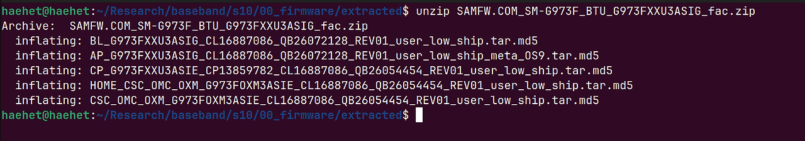
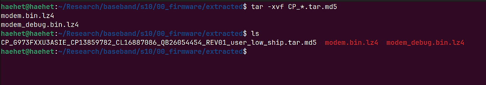
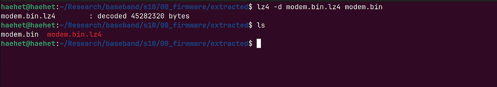
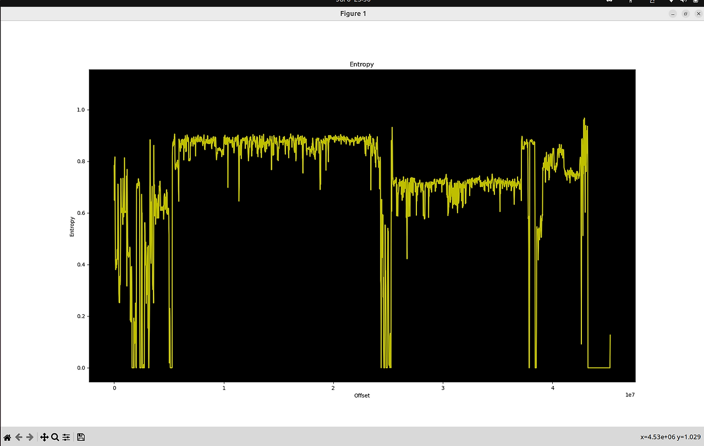
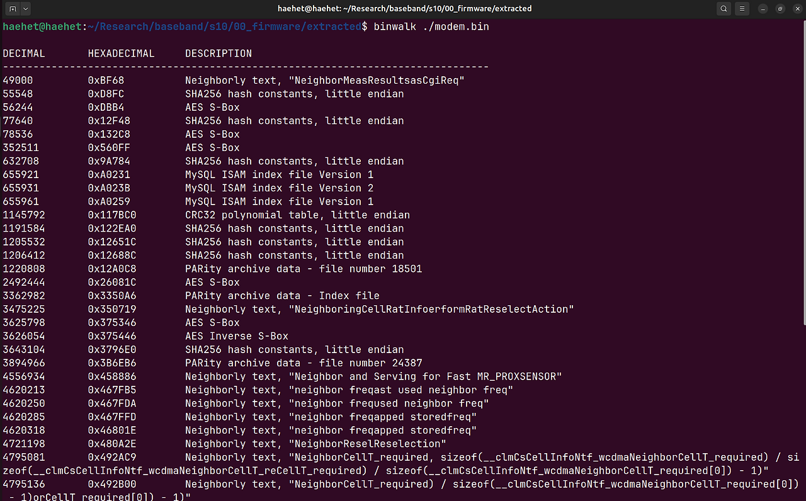
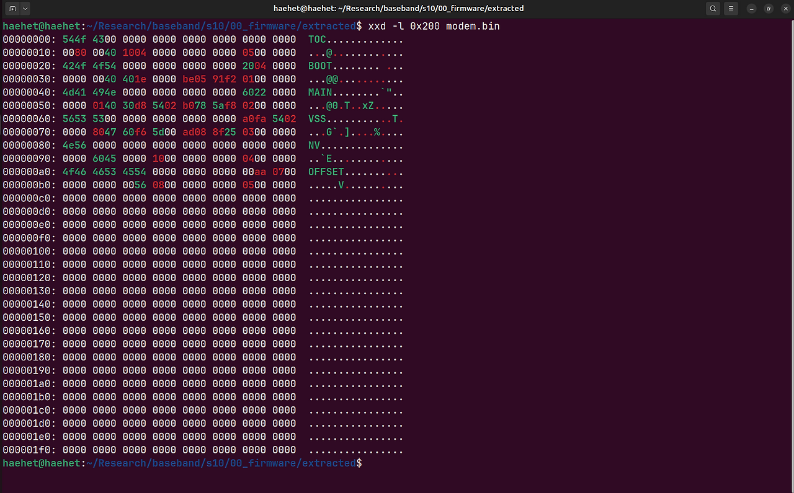
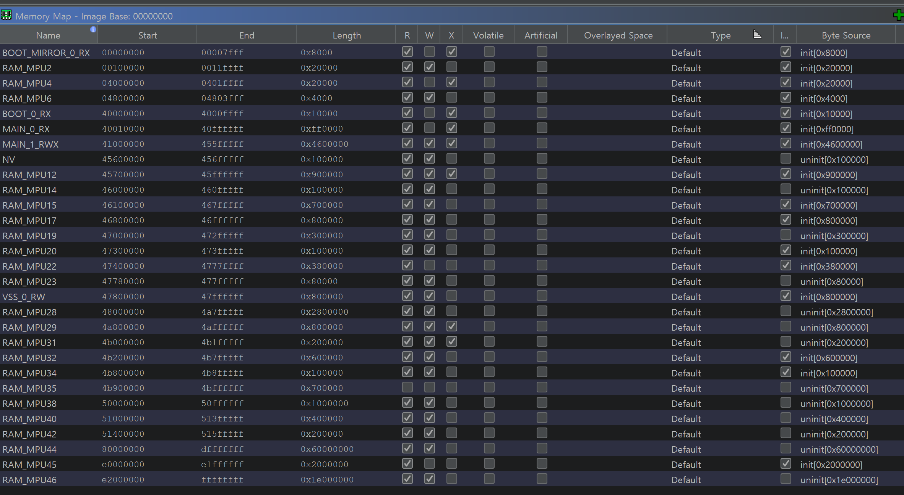

## Analysis Target

In this study, the following firmware was selected as the reference target in order to analyze the structure of the Shannon baseband firmware installed in Samsung Exynos-based smartphones.

* Device: Samsung Galaxy S10
* Model: SM-G973N
* SoC: Samsung Exynos 9820
* Baseband: Samsung Shannon
* AP Firmware Version: G973NKSU7HWA1
* CP Firmware Version: G973NKOU7HVL3
* Android Version: Android 12
* Security Patch Level: January 2023
* Target Region: South Korea

Initially, the boot process and task management structure of the Shannon RTOS were analyzed using the `G973FXXU3ASIG` firmware of the global SM-G973F model. Later, the firmware of the SM-G973N, which was obtained as an actual test device, was compared, and it was confirmed that the MAIN initialization process, PAL task management structure, TCB, and static task descriptor structure were mostly maintained in the same form.

Accordingly, the existing analysis results were transferred to the SM-G973N firmware, and the subsequent analysis was conducted based on `G973NKOU7HVL3`, the CP firmware installed on the actual device. Through this, the static analysis results could be directly compared with the modem logs and runtime behavior of the actual device.

---

## Firmware Extraction Process

First, `G973NKSU7HWA1` was downloaded from SAMFW.

After that, the downloaded firmware was extracted using `unzip`.



Then, the CP archive was extracted.



The `modem.bin.lz4` file in the LZ4 format was then decompressed to obtain `modem.bin`.



After that, the entropy was checked using the Binwalk `-E` option to determine the possibility of encryption.



As can be seen from the graph above, the entropy distribution of the firmware that we are trying to analyze does not appear uniformly. Therefore, it can be determined that the firmware is not encrypted.

---

## Section Extraction and Ghidra Loading

First, section extraction using Binwalk was attempted, but it was not possible to analyze this firmware using Binwalk.



At the beginning of `modem.bin`, a **TOC (Table of Contents)-type structure** exists. This TOC indicates which sections exist inside the firmware, where each section is located in the file, and at which address it is loaded in CP memory. The structure of each TOC entry is as follows.

```c
struct toc_entry {
    char     section_name[12];  // Section name
    uint32_t offset;            // Offset
    uint32_t load_addr;         // Address where it will be loaded into memory
    uint32_t size;              // Section size
    uint32_t crc;               // CRC
    uint32_t entry_index;       // Entry
};
```



After that, the memory map was examined using the Ghidra ShannonLoader, and the result was as follows.


