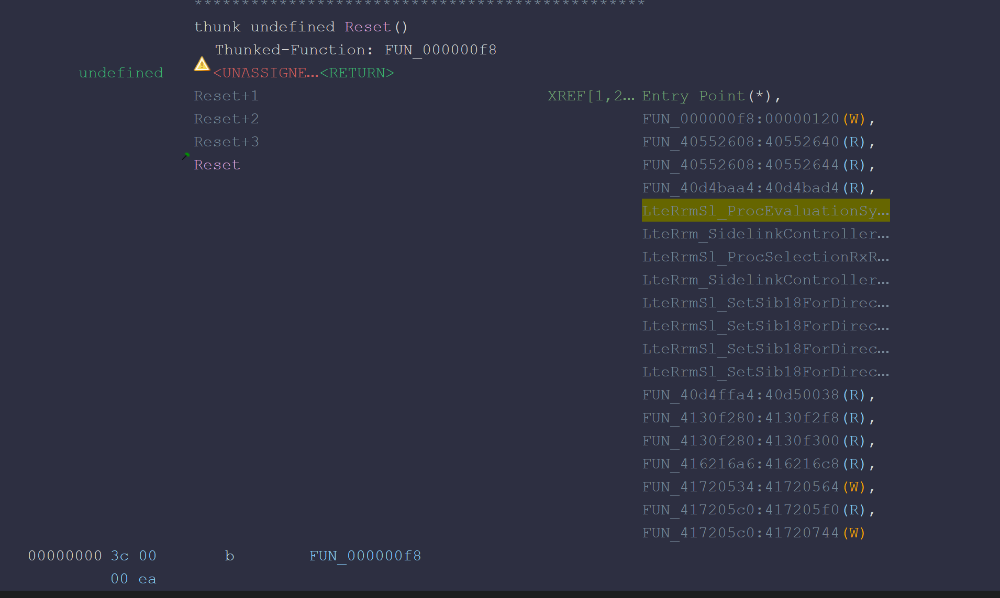

## CBD (CP Boot Daemon)

The baseband boot process of the Samsung Galaxy S10 begins during the initialization process on the AP (Application Processor) side.

When Android boots, the `cbd` process is executed by an init script. `cbd` is a daemon that manages CP booting and starts the CP boot process using the baseband firmware stored in the radio partition.

```bash
on init
    symlink /dev/block/platform/13d60000.ufs/by-name/radio /dev/mbin0
    restorecon /dev/mbin0

    write /proc/sys/net/core/netdev_max_backlog 100000

on post-fs-data
    chown radio radio /sys/devices/virtual/misc/multipdp/waketime
    chmod 0660 /sys/devices/virtual/misc/umts_dm0/dm_state
    chown radio system /sys/devices/virtual/misc/umts_dm0/dm_state

    # /mnt/vendor/efs/factory.prop for Dual / Single SIM settings
    chown radio radio /mnt/vendor/efs/factory.prop
    chmod 0600 /mnt/vendor/efs/factory.prop

service cpboot-daemon /vendor/bin/cbd -d -tss310 -bm -mm -P platform/13d60000.ufs/by-name/radio
    class main
    user root
    group radio cache inet misc audio sdcard_rw log sdcard_r shell system
    seclabel u:r:cbd:s0

on property:ro.vendor.multisim.simslotcount=*
   write /sys/module/modem_ctrl_s5000ap/parameters/ds_detect ${ro.vendor.multisim.simslotcount}

on property:ro.vendor.multisim.simslotcount=1
    setprop persist.radio.multisim.config ss

on property:ro.vendor.multisim.simslotcount=2
    setprop persist.radio.multisim.config dsds
```

During the initialization process, the radio partition is linked to the device path `/dev/mbin0`, and the `cpboot-daemon` service then executes `/vendor/bin/cbd`. From the `platform/13d60000.ufs/by-name/radio` path passed as an execution argument, it can be confirmed that `cbd` uses the baseband firmware stored in the radio partition.

In addition, because the configuration value of the `modem_ctrl_s5000ap` kernel module is changed according to the number of SIM slots, it appears that `cbd` and the init script are involved not only in CP booting but also in the initial configuration of the modem hardware and communication environment.

At present, the internal operation of the `cbd` binary has not been analyzed in detail. However, it is presumed to communicate with the AP-side kernel driver and perform operations such as firmware loading, CP boot requests, and status checking. If the boot path between the AP and CP needs to be examined in greater detail later, it appears necessary to additionally analyze the system calls and ioctl handling portions of `cbd`.

---

## Booting Process

The Shannon baseband firmware operates on an ARM-based processor, and when the CPU is reset, execution enters the initial boot code through the Reset Vector in the exception vector table.

In the target firmware, the actual load address of the BOOT section is `0x40000000`. However, in Ghidra's memory map, part of the BOOT code is also mapped to the `0x00000000` region under the name `BOOT_MIRROR`.

This is presumed to be a structure in which the vector table of the BOOT region is mirrored or hardware-mapped to the low-address region so that the ARM processor can fetch instructions from the designated vector address immediately after reset.



The Reset Vector is decompiled as follows.

```c
void Reset(void)

{
  bool bVar1;
  uint uVar2;
  undefined4 *puVar3;
  undefined *puVar4;
  
  if (DAT_82001004 == (undefined *)0x0) {
    bVar1 = true;
    puVar4 = (undefined *)0x1;
    if (DAT_82001000 != 1) {
      do {
      } while( true );
    }
  }
  else {
    bVar1 = false;
    puVar4 = DAT_82001004;
  }
  uVar2 = coproc_movefrom_Control();
  puVar3 = (undefined4 *)(uVar2 & 0xffffeffa);
  coproc_moveto_Control(puVar3);
  if (!bVar1) {
    DAT_83003000 = 0;
    puVar3 = &DAT_82001400;
    DAT_00002e80 = 0x21424221;
    DAT_00002e84 = DAT_82001404;
    DAT_00002e88 = DAT_82001408;
    puVar4 = &DAT_00002e8c
  }
  FUN_0000185c(puVar3,puVar4);
  DAT_00002eb0 = 0x21504421;
  DAT_00002eb4 = DAT_80140000;
  DAT_00002eb8 = DAT_80140008;
  DAT_00002ebc = DAT_80140140;
  DAT_00002ec0 = 0x21494321;
  DAT_00002ec4 = DAT_82005010;
  DAT_00002ec8 = DAT_82005014;
  FUN_00001a04(&DAT_82005000,&DAT_00002ecc);
  if (bVar1) {
    (*(code *)&LAB_40010000)();
    return;
  }
  Boot_DispatchBootCommand();
  do {
  } while( true );
}
```

In the initial BOOT code, the SCTLR of CP15 is read, and the `I`, `C`, and `M` bits are cleared to disable the instruction cache, data cache, and MPU (Memory Protection Unit). This is considered to be a preliminary operation for resetting the existing memory-system configuration and reconfiguring the MPU regions and caches during the BOOT stage.

Afterward, `Boot_DispatchBootCommand()` checks the current boot mode and selects an execution path according to the value.

```c
void Boot_DispatchBootCommand(void)

{
  int iVar1;
  void *return_address;
  int boot_mode;
  
  iVar1 = DAT_82001004;
  FUN_00000924();
  if (iVar1 != 0) {
    FUN_00000874();
    uart_puts("Feb 18 2021");
    uart_putc(L'@');
    uart_puts(&DAT_00001db8);
    uart_puts(L'԰');
    uart_puts(L'Դ');
    FUN_00000824();
    uart_putc(L'F');
    FUN_00000228();
    uart_putc(L'G');
    boot_mode = *DAT_0000053c;
    uart_puts(L'Հ');
    FUN_000009f0(boot_mode);
    uart_puts(L'Ո');
  }
  if (boot_mode == DUMP) {
    FUN_00000e04();
    uart_putc(L'#');
    Crash();
    Stage();
    uart_puts(0x550);
    FUN_00000d84(&DAT_00002e00);
  }
  else {
    if (boot_mode == BOOT) {
      FUN_00000e04(0x424f4f54);
      uart_putc(L'#');
      FUN_000002e0();
      uart_puts(L'ը');
      return_address = (void *)Boot_GetMainBaseIfReady();
                    /* check if the address is available  */
      if ((void *)0x10000000 < return_address) {
        Boot_JumpToMainImage(return_address);
        goto LAB_000004f0;
      }
    }
    uart_puts();
  }
LAB_000004f0:
  do {
  } while( true );
}
```

When `MAGIC_DUMP` is passed, execution enters the crash- and dump-related routines and prints `"Done\n"` through UART after processing is complete. In contrast, when `MAGIC_BOOT` is passed, the processing required for normal booting is performed, after which `"Boot\n"` is printed.

---

## Control Flow from BOOT to the MAIN Section

The Reset function contains a path that enters MAIN directly without passing through `Boot_DispatchBootCommand()`. Therefore, if this special condition is satisfied, it is possible to enter the MAIN section immediately.

```c
if (bVar1) {
    (*(code *)&LAB_40010000)();
    return;
}

Boot_DispatchBootCommand();
```

Another path is through `Boot_DispatchBootCommand()`.

After checking the boot mode, `Boot_DispatchBootCommand()` performs the transition to the MAIN section when the `MAGIC_BOOT` value, which indicates normal booting, is set.

When the normal boot mode is selected, BOOT does not immediately branch to the MAIN section. Instead, it exchanges control messages with an AP-side boot component through shared memory.

In `Boot_GetMainBaseIfReady()`, an 8-byte message is read from the shared-memory ring buffer, and the command value contained in the message is checked.

```text
AP-side boot component
        ↓
Writes a control message to the shared-memory ring buffer
        ↓
CP BOOT receives an 8-byte message
        ↓
Checks the command value and transmits a response
```

The shared-memory control region exists near `0x4B200000`, and the actual data ring buffer begins at `0x4B203000`. When the read index and write index are equal, the receive function waits until new data is written and then copies the requested data into local memory.

When the end of the ring buffer is reached, the data is divided between the end and beginning of the buffer and copied separately. After the copy is complete, the read index is updated. From this, it can be determined that the AP and CP use a single shared-memory region in the form of a circular buffer.

During the process of checking whether MAIN is ready for execution, a two-stage command exchange is performed.

```text
First request  : 0x900D
First response : 0xA00D

Second request  : 0x9F00
Second response : 0xAF00
```

If the received command value matches the expected value, BOOT writes a response message to the shared-memory transmission region. It then updates the transmission index and appears to manipulate an MMIO register to notify the AP side that a new response is ready.

```text
Write response message
        ↓
Update shared-memory TX index
        ↓
Set mailbox- or interrupt-related registers
        ↓
Notify the AP side that the response is ready
```

When both handshakes succeed, the function returns `0x40010000`, which is the start address of the MAIN section.

```c
undefined1 *
Boot_GetMainBaseIfReady(undefined4 param_1,undefined4 param_2,undefined4 param_3,int param_4)

{
  undefined *puVar1;
  undefined4 uStack_10;
  int local_c;
  
  DAT_00001c20 = 0;
  uStack_10 = param_3;
  local_c = param_4;
  Boot_ShmemRingRead(&uStack_10,8);
  if (local_c == 0x900d) {
    uStack_10._0_2_ = CONCAT11(0xd7,(undefined1)uStack_10);
    local_c = 0xa00d;
    Boot_ShmemRingWrite(&uStack_10,8);
    FUN_00000e20();
    uart_puts("Ready => ");
    Boot_ShmemRingRead(&uStack_10,8);
    if (local_c == 0x9f00) {
      uStack_10._0_2_ = CONCAT11(0xd7,(undefined1)uStack_10);
      local_c = 0xaf00;
      Boot_ShmemRingWrite(&uStack_10,8);
      FUN_00000e20();
      return &LAB_40010000;
    }
    puVar1 = &DAT_00001310;
  }
  else {
    puVar1 = &DAT_000012f8;
  }
  uart_puts(puVar1);
  return (undefined1 *)0x1;
}
```

Afterward, it checks whether the returned address is greater than `0x10000000`, meaning that it is valid, and calls `Boot_JumpToMainImage()` to jump to the MAIN section.

```c
void Boot_JumpToMainImage(void *address_base)

{
  char cVar1;
  undefined4 uVar2;
  
  cVar1 = FUN_00001740();
  if (cVar1 == '\0') {
    uVar2 = L'r';
  }
  else if (cVar1 == '\x01') {
    uVar2 = L'c';
  }
  else {
    uVar2 = L'e';
  }
  uart_putc(uVar2);
  FUN_00000ac4(&DAT_00002e00);
  uart_putc(L'@');
  FUN_00000af8();
  uart_putc(L'R');
  FUN_00000d10(&DAT_00002e00);
  FUN_00001b7c();
  uart_putc(L'u');
  FUN_00000734();
  FUN_000006ac();
  uart_puts(0x4f4);
  (*address_base)();
  return;
}
```

---

The current analysis has not examined the booting process in depth or closely analyzed and verified the shared-memory configuration and hardware MMIO structure. This is because the goal of this research is not emulation, but rather the analysis of the wireless communication architecture and vulnerabilities. Therefore, deeper analysis may be necessary in the future if required.
