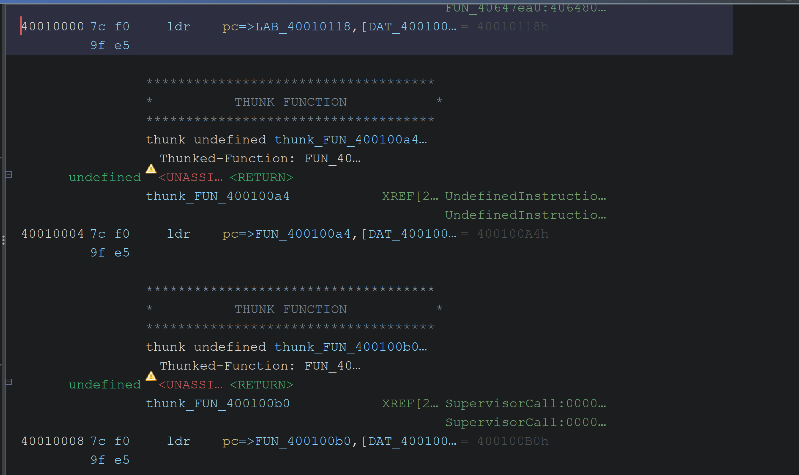

## MAIN Entry



When BOOT transfers control to `0x40010000`, the start address of the MAIN image, the initialization routine located at `0x40010118` is executed through the entry stub at that address.

At the beginning of the MAIN image, branch entries similar to an ARM exception vector table are placed. After checking the handlers pointed to by each entry, some of them matched the exception handlers identified in the low vector table. Therefore, this region may be a vector table used after MAIN execution begins, or a structure used to connect the existing vector handlers.

However, no code that changes the Vector Base Address Register (VBAR) or remaps the low vector region to this location has been identified so far.

---

## CPU and Context Initialization

The MAIN initialization routine first saves the current `CPSR`, `SPSR`, `SP`, and `LR`, switches between the ARM FIQ and SVC modes, and constructs the initial execution context. During this process, it checks the banked registers and stack pointer state of FIQ mode and initializes a descriptor related to the power-on state when necessary. In addition, when a previous execution context exists, some register values are preserved in a separate memory region.

```nasm
                  LAB_40010118                   XREF[1  40010000 (j)   
  40010118 00  00     mrs    r0 , cpsr
           0f  e1
  4001011c 01  0c     bic    r0 , r0 , # 0x100                  abort mask clear
           c0  e3
  40010120 00  f0     msr    c p s r _ c x s f , r0
           2f  e1
  40010124 00  10     mrs    r1 , spsr
           4f  e1
  40010128 0d  20     cpy    r2 , sp
           a0  e1
  4001012c 0e  30     cpy    r3 , lr
           a0  e1
  40010130 d1  f0     msr    c p s r _ c , # 0xd1
           21  e3
  40010134 01  00     tst    r12 , # 0x1
           1c  e3
  40010138 03  70     cpyeq  r7 , r3
           a0  01
  4001013c 02  60     cpyeq  r6 , r2
           a0  01
  40010140 01  50     cpyeq  r5 , r1
           a0  01
  40010144 00  40     cpyeq  r4 , r0
           a0  01
  40010148 01  c0     moveq  r12 , # 0x1
           a0  03
  4001014c d3  f0     msr    c p s r _ c , # 0xd3
           21  e3
  40010150 08  d1     ldr    sp , [ DAT_40010260 ]             = 41849090h
           9f  e5
  40010154 c2  b1     bl     CheckFiqBankedContext          undefined CheckFiqB
           5b  eb
  40010158 01  00     cmp    r0 , # 0x1
           50  e3
  4001015c 00  11     ldreq  r1 => InitPowerOnDescriptor+1 ,  = 4054DE63h
           9f  05
  40010160 31  ff     blxeq  r1 => InitPowerOnDescriptor      undefined InitPower
           2f  01
  40010164 be  b1     bl     CheckFiqBankedContext          undefined CheckFiqB
           5b  eb
  40010168 01  00     cmp    r0 , # 0x1
           50  e3
  4001016c 05  00     beq    LAB_40010188
           00  0a
  40010170 f0  00     ldr    r0 , [ DAT_40010268 ]             = 41849090h
           9f  e5
  40010174 f0  00     stmia  r0 ! , { r4 , r5 , r6 , r7 } => DAT_4184   = "pal_EMsgEntity_L
           a0  e8
  40010178 ec  10     ldr    r1 => DAT_82001004 , [ DAT_400102  = ??
           9f  e5                                           = 82001004h
  4001017c 00  20     ldr    r2 , [ r1 , # 0x0 ] => DAT_82001004    = ??
           91  e5
  40010180 00  00     cmp    r2 , # 0x0
           52  e3
  40010184 ff  ff     beq    LAB_40010188
           ff  0a
```

Afterward, it configures the CPU control registers and cache-related state and enables the ITCM and DTCM. Some initial code and data are copied into the TCM regions, and depending on the condition, a checksum verification of the existing context region is also performed. Finally, the banked stacks used by each processor mode, including IRQ, FIQ, and Abort, are configured in the DTCM region.

This process is a low-level initialization stage that prepares the CPU modes, exception context, stacks, and high-speed memory environment before the RTOS and general C code are executed in MAIN. Once initialization is complete, execution branches from `0x400101FC` to `0x416FC448`, moving to the C runtime and memory initialization process.

```nasm
                  LAB_40010188                   XREF[2  4001016c (j) , 
                                                         40010184 (j)   
  40010188 86  b1     bl     Cpu_ConfigureSctlrAndInvali    undefined Cpu_Confi
           5b  eb
  4001018c dc  00     ldr    r0 => SCATTERED_FROM_42381920 ,  = 04000000h
           9f  e5
  40010190 a1  b1     bl     Tcm_EnableITCMAtBase           undefined Tcm_Enabl
           5b  eb
  40010194 d8  00     ldr    r0 => SCATTERED_FROM_4239e3d8 ,  = 40h    @
           9f  e5                                           = 04800C30h
  40010198 7b  af     bl     Tcm_ConfigureAndEnableDTCM     undefined Tcm_Confi
           5c  eb
  4001019c 51  bb     bl     Tcm_CopyBootImagesToITCMAnd    undefined Tcm_CopyB
           5b  eb
  400101a0 af  b1     bl     CheckFiqBankedContext          undefined CheckFiqB
           5b  eb
  400101a4 01  00     cmp    r0 , # 0x1
           50  e3
  400101a8 0a  00     bne    LAB_400101d8
           00  1a
  400101ac 00  00     mov    r0 , # 0x0
           a0  e3
                  LAB_400101b0                   XREF[1  400101d0 (j)   
  400101b0 c0  10     ldr    r1 , [ DAT_40010278 ]             = 43E27458h
           9f  e5
  400101b4 00  00     str    r0 , [ r1 , # 0x0 ] => DAT_43e27458
           81  e5
  400101b8 b8  10     ldr    r1 , [ DAT_40010278 ]             = 43E27458h
           9f  e5
  400101bc 00  00     cmp    r0 , # 0x0
           50  e3
  400101c0 00  00     streq  r0 , [ r1 , # 0x0 ] => DAT_43e27458
           81  05
  400101c4 03  00     beq    LAB_400101d8
           00  0a
  400101c8 00  10     ldr    r1 , [ r1 , # 0x0 ] => DAT_43e27458
           91  e5
  400101cc 01  00     cmp    r0 , r1
           50  e1
  400101d0 f6  ff     bne    LAB_400101b0
           ff  1a
  400101d4 17  00     b      LAB_40010238
           00  ea
                  LAB_400101d8                   XREF[2  400101a8 (j) , 
                                                         400101c4 (j)   
  400101d8 d1  f0     msr    c p s r _ c , # 0xd1
           21  e3
  400101dc 0d  00     movs   r0 => DAT_41849090 , sp
           b0  e1
  400101e0 d3  f0     msr    c p s r _ c , # 0xd3
           21  e3
  400101e4 80  10     ldr    r1 => DAT_82001004 , [ DAT_400102  = ??
           9f  e5                                           = 82001004h
  400101e8 00  20     ldr    r2 , [ r1 , # 0x0 ] => DAT_82001004    = ??
           91  e5
  400101ec 00  00     cmp    r2 , # 0x0
           52  e3
  400101f0 00  00     beq    LAB_400101f8
           00  0a
  400101f4 10  00     bl     ComputeChecksum                undefined ComputeCh
           00  eb
                  LAB_400101f8                   XREF[1  400101f0 (j)   
  400101f8 ab  b1     bl     Cpu_InitBankedModeStacksInD    undefined Cpu_InitB
           5b  eb
  400101fc 91  b0     b      LAB_416fc448
           5b  ea
```

---

## C Runtime and Memory Initialization

Once the CPU and exception context configuration is complete, control is transferred to the ARM C runtime initialization code. First, `__scatterload` is executed to copy or initialize the data regions defined in the scatter-loading table to their actual execution addresses. Through this process, the memory environment used at runtime by initialized global and static variables is constructed.

```nasm
                  LAB_416fc448                   XREF[1  400101fc (j)   
  416fc448 d2  87     blx    __scatterload                  undefined __scatter
           fb  fa
  416fc44c 38  38     blx    Main_ClearZIAndContinue        undefined Main_Clea
           b9  fa
```

Afterward, `Main_ClearZIAndContinue()` calls `ClearMainZiRegion()` to initialize the memory region from `0x418490A0` to `0x43E27458` to zero. This function stores multiple zeroed registers at once, clearing most of the region in 16-byte units and then additionally processing the remaining region at the end. This can be considered the initialization process for the ZI (Zero-Initialized) region, where uninitialized global and static variables in the MAIN image are placed.

```nasm
                  ************************************
                  *              FUNCTION               *
                  ************************************
                  undefined  Main_ClearZIAndContinue ( )
                    assume LRset = 0x0
                    assume TMode = 0x1
        undefined   <UNASSI  <RETURN>
                  Main_ClearZIAndContinue        XREF[1  416fc44c (c)   
  4054a534 10  b5     push   { r4 , lr }
  4054a536 c5  f6     blx    ClearMainZiRegion              undefined ClearMain
           64  e6
  4054a53a bd  e8     pop.w  { r4 , lr }
           10  40
  4054a53e da  f0     b.w    LAB_40e2510c
           e5  9d
```

Once initialization of the ZI region is complete, execution passes through `LAB_40E2510C` and moves to `__rt_entry` at `0x416FC434`. `__rt_entry` is the upper-level entry routine of the ARM C runtime. It configures the stack and heap, initializes the runtime library, and then calls `Main()`, the C entry function of the firmware.

```nasm
                  __rt_entry                     XREF[1  40e2510c (j)   
  416fc434 28  f7     bl     __rt_stackheap_init            undefined __rt_stac
           74  de
  416fc438 11  46     mov    r1 , r2
  416fc43a 28  f7     bl     __rt_lib_init                  undefined __rt_lib_
           63  de
  416fc43e 28  f7     bl     Main                           undefined Main()
           63  de
  416fc442 e6  f7     bl     __rt_exit                      undefined __rt_exit
           59  df
  416fc446 00  00     movs   r0 , r0
```

`__rt_stackheap_init()` configures the layout of the stack and heap used by the C code, and `__rt_lib_init()` initializes the runtime state related to the C library. Once these preparations are complete, `Main()` is called, and execution transitions from the low-level assembly initialization stage to the execution stage of general C code.

The `Main` function then performs the following specific operations and creates `MainTask`.

```c
void Main(void)

{
  FUN_40558d5a();
  FUN_4054a596();
  thunk_FUN_04004440();
  thunk_FUN_416fc92c(&DAT_04800c20);
  FUN_4054aa94();
  pal_CreateMainTask();
  do {
  } while( true );
}
```

---

The scatter-loading process and the memory structures used by each context mode have not yet been clearly analyzed. It may be useful to analyze them later if they become necessary when verifying a discovered vulnerability.
