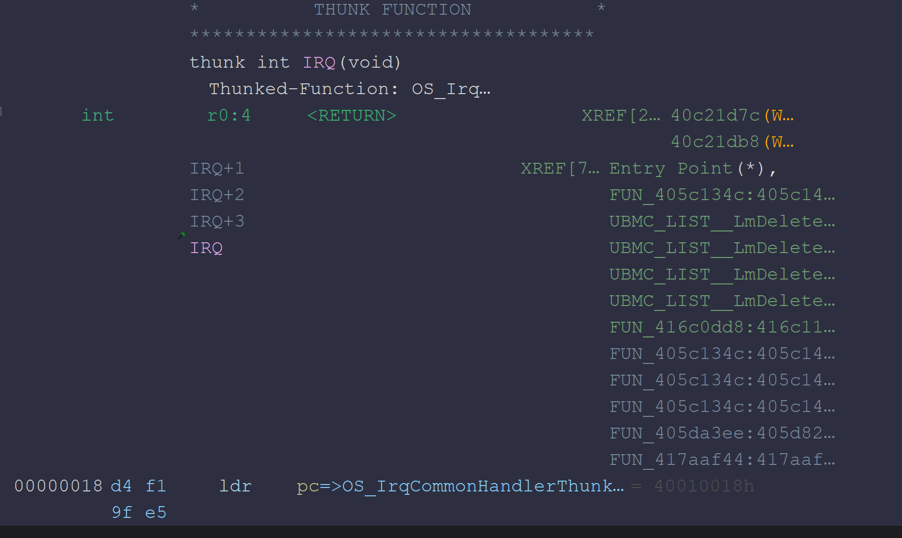

## Reset Vector to IRQ Handler

When a hardware interrupt occurs during MAIN execution, the ARM processor transfers control to `0x00000018`, the IRQ entry in the exception vector table. This entry branches to the IRQ handler stub in the MAIN region through an `LDR PC` instruction and is then connected to the common IRQ handling routine, `OS_IrqCommonHandler()`.


---

## OS_IrqCommonHandler

`OS_IrqCommonHandler()` is the common entry and return routine through which all general IRQs pass. The function saves the context of the task that was executing when the interrupt occurred and then executes the handler corresponding to the active IRQ number. It subsequently checks whether any task newly entered the ready state during IRQ processing and restores the processor context of the task selected by the scheduler, returning execution to that task.

The reconstructed decompilation result is as follows.

```c
/* Setting prototype: int OS_IrqCommonHandler(void) */

int OS_IrqCommonHandler(void)

{
  TCB *dispatch_tcb;
  int restored_context;
  int context_state;
  uint saved_status_word;
  uint return_status_word;
  uint *saved_context;
  
  OS_SaveInterruptedTaskContext();
  OS_DispatchActiveIrq();
  Scheduler_UpdateCurrentIfHigherReady();
  dispatch_tcb = (TCB *)Scheduler_Dispatch(current_task_id);
  saved_context = dispatch_tcb->saved_sp;
  context_state = dispatch_tcb->context_state;
  saved_status_word = *saved_context;
  return_status_word = saved_status_word | 0xc0;
  if (g_irqReturnMaskFlag == 0) {
    return_status_word = saved_status_word & 0xffffff3f;
  }
  if (context_state != 1) {
    if (context_state != 2) {
      restored_context =
           OS_OnTaskDispatchBeforeReturn(dispatch_tcb,context_state,return_status_word);
      return restored_context;
    }
    return (int)dispatch_tcb;
  }
  OS_OnTaskDispatchBeforeReturn(dispatch_tcb,1,return_status_word);
  return saved_context[1];
}
```

Upon entering the function, the basic registers used during IRQ processing and the point at which the interrupt occurred are first saved on the current IRQ stack.

```nasm
400100E0  stmdb sp!, {r0, r1, r2, r3, r4, r5}
400100E4  sub   r4, lr, #4
400100E8  bl    OS_SaveInterruptedTaskContext
```

The `STMDB SP!` instruction pushes registers `r0` through `r5` onto the stack. Because these registers may be modified inside the IRQ handler, this process preserves them first so that their original values can be restored when returning to the interrupted task.

```text
IRQ stack
 → saved r0
 → saved r1
 → saved r2
 → saved r3
 → saved r4
 → saved r5
```

The value obtained by subtracting 4 from the IRQ-mode `LR` is then stored in `r4`.

```nasm
sub r4, lr, #4
```

When the ARM processor enters an IRQ exception, `LR_irq` stores the address required to return to the interrupt point. Because this value must be adjusted by 4 to represent the actual interrupted instruction position, `r4` stores the return PC of the interrupted task that will later be restored.

```c
interrupted_pc = lr_irq - 4;
```

Therefore, before `OS_SaveInterruptedTaskContext()` is called, the entry stub first preserves the general-purpose registers on a temporary IRQ stack and calculates the execution address immediately before the IRQ occurred.

`OS_SaveInterruptedTaskContext()` then reflects these values, including the processor context, in the task's TCB and saved stack so that the task that was previously executing can later resume from the same point.

---

## OS_SaveInterruptedTaskContext

After the temporary registers are saved by the IRQ entry stub, `OS_SaveInterruptedTaskContext()` is called. This function saves the processor context of the task that was executing before the IRQ occurred and records the location of the context frame in the current task's TCB.

```c
void OS_SaveInterruptedTaskContext(void)

{
  int current_tcb;
  undefined1 *puStack0000000c;
  undefined4 irq_frame [4];
  undefined1 *irq_sp_snapshot;
  
  if (current_task_id != 0x420) {
    puStack0000000c = &stack0x00000018;
    irq_sp_snapshot = &stack0x00000018;
    irq_frame[0] = 0;
    current_tcb = (&DAT_43a4b8a8)[current_task_id];
    *(undefined4 **)(current_tcb + 0x30) = irq_frame;
    if (((int)irq_frame < *(int *)(current_tcb + 0x2c)) ||
       (*(int *)(current_tcb + 0x28) < (int)irq_frame)) {
      current_tcb = OS_ReportStackOverflow();
    }
    *(undefined4 *)(current_tcb + 0x34) = 1;
    return;
  }
  return;
}
```

The function first reads the currently selected task ID and compares it with the special value `0x420`.

```nasm
40c21cc4  ldr    r1, [LAB_40c21ed8]
40c21cc8  ldr    r1, [r1, #0x0]
40c21ccc  cmp    r1, #0x420
40c21cd0  beq    LAB_40c21d54
```

If the current task ID is not `0x420`, execution enters the context-saving path for a regular task. `0x420` is a special scheduler context ID for which a normal TCB is not retrieved from the global task table.

The current IRQ stack pointer, function return address, and processor status before the IRQ are then preserved.

```nasm
40c21cd4  cpy    r1, sp
40c21cd8  cpy    r2, lr
40c21cdc  mrs    r3, spsr
40c21ce0  add    sp, sp, #0x18
```

Because six registers, `r0-r5`, were previously saved on the stack by the `OS_IrqCommonHandler()` entry stub, the temporary frame has a size of `0x18` bytes. The IRQ stack is restored to its original position by increasing `SP` by `0x18`. However, because the previous frame address remains preserved in `r1`, the saved register values can still be retrieved later.

The processor-mode bits of the CPSR are then modified to switch from IRQ mode to Supervisor mode.

```nasm
40c21ce4  mrs    r5, cpsr
40c21ce8  bic    r5, r5, #0x1f
40c21cec  orr    r5, r5, #0x13
40c21cf0  msr    cpsr_cxsf, r5
```

The ARM processor uses banked `SP` and `LR` registers for each processor mode. Therefore, switching to Supervisor mode provides access to the SVC stack used by the interrupted task instead of the IRQ stack.

The following instructions store additional processor context on the interrupted task's stack.

```nasm
40c21cf4  cpy    r5, sp
40c21cf8  stmdb  r5!, {r4}
40c21cfc  stmdb  r5!, {r6, r7, r8, r9, r10, r11, ...}
40c21d00  cpy    sp, r5
```

`r4` contains `LR_irq - 4`, which was calculated in the `OS_IrqCommonHandler()` entry stub and represents the PC to which execution must return after IRQ processing.

The register list at `0x40C21CFC` is truncated in the current Ghidra output, so the complete set of stored registers cannot be determined from this code alone. However, it can be confirmed that the routine switches to Supervisor mode and saves the additional register context of the interrupted task on the task's stack.

The six registers temporarily saved by the IRQ entry stub are then read and transferred to the task stack.

```nasm
40c21d04  ldmia  r1!, {r5, r6, r7, r8, r9, r10}
40c21d08  stmdb  sp!, {r5, r6, r7, r8, r9, r10}
40c21d0c  stmdb  sp!, {r3}
```

The values loaded into `r5-r10` are actually the interrupted task's original `r0-r5` values. Finally, the previously read `SPSR_irq` is also stored on the stack.

Therefore, the processor status before the IRQ is placed at the beginning of the completed context frame, followed by the interrupted task's registers and return address.

The current task ID is then used to retrieve the TCB from the global task table.

```nasm
40c21d10  ldr    r0, [LAB_40c21ed8]
40c21d14  ldr    r0, [r0, #0x0]
40c21d18  ldr    r1, [DAT_40c21edc]
40c21d1c  ldr    r0, [r1, r0, lsl #2]
```

The stack pointer of the newly constructed context frame is stored in the `+0x30` field of the TCB.

```nasm
40c21d20  str    sp, [r0, #0x30]
```

Therefore, `TCB + 0x30` points to the beginning of the processor context that the scheduler must restore when the task is executed again.

The function then checks whether the saved stack pointer remains within the stack range assigned to the task.

```nasm
40c21d24  ldr    r8, [r0, #0x2c]
40c21d28  cmp    sp, r8
40c21d2c  blt    LAB_40c21d3c
40c21d30  ldr    r9, [r0, #0x28]
40c21d34  cmp    sp, r9
40c21d38  ble    LAB_40c21d40

40c21d3c  bl     OS_ReportStackOverflow
```

If `SP` is outside the stack boundaries stored in the TCB, `OS_ReportStackOverflow()` is called.

Once context saving is complete, the `+0x34` field of the TCB is set to 1.

```nasm
40c21d40  mov    r1, #0x1
40c21d44  str    r1, [r0, #0x34]
```

This value indicates that an IRQ-saved context frame exists for the task. During the subsequent context-restoration process, this context is restored through the `context_state == 1` path.

Finally, the common IRQ processing stack pointer stored in a global variable is assigned to the actual `SP`, and execution branches to the previously preserved return address.

```nasm
40c21d48  ldr    r1, [DAT_40c21ee0]
40c21d4c  ldr    sp, [r1, #0x0]
40c21d50  bx     r2
```

Therefore, the subsequent active IRQ dispatch and scheduling processes are performed on a separate common IRQ stack rather than on the stack of the interrupted task.

If the current task ID is the special value `0x420`, TCB context saving is skipped.

```nasm
40c21d54  cpy    r2, lr
40c21d58  add    sp, sp, #0x18
40c21d5c  mrs    r1, cpsr
40c21d60  bic    r1, r1, #0x1f
40c21d64  orr    r1, r1, #0x13
40c21d68  msr    cpsr_cxsf, r1
40c21d6c  bx     r2
```

In this path, only the temporary stack frame created by the IRQ entry stub is removed. The processor then switches to Supervisor mode and immediately returns.

---

## OS_DispatchActiveIrq

After the context of the current task has been saved, `OS_DispatchActiveIrq()` is called. `OS_DispatchActiveIrq()` reads the currently active IRQ number from the interrupt controller, finds the interrupt object registered for that IRQ number, and executes its callback.

```c
void OS_DispatchActiveIrq(void)

{
  int irq_object;
  int timestamp;
  uint uVar1;
  
  uVar1 = DAT_8000010c;
  timestamp = 0;
  DAT_04800fb8 = 0;
  *(uint *)(&DAT_4328fe30 + DAT_418013b0 * 4) = DAT_8000010c;
  DAT_418013b0 = DAT_418013b0 + 1;
  if (0x1fff < DAT_418013b0) {
    DAT_418013b0 = 0;
  }
  uVar1 = uVar1 & 0x3ff;
  if (DAT_04800d24 == '\0') {
    DAT_04800fb8 = 1;
    timestamp = FUN_04007428();
    DAT_04800fb8 = 2;
    DAT_04800d2c = (timestamp - DAT_04800d30) + DAT_04800d2c;
  }
  if (uVar1 < 299) {
    irq_object = *(int *)(&DAT_4014951c + uVar1 * 4);
    if ((irq_object == 0) || (*(int *)(irq_object + 0xc) == 0)) {
      _Reset = 0xffffffff;
    }
    else {
      if (DAT_04800d28 != 0) {
        if (DAT_04800d24 != '\0') {
          DAT_04800fb8 = 3;
          timestamp = FUN_04007428();
          DAT_04800fb8 = 4;
        }
        if (DAT_42e9b070 != 0) {
          thunk_FUN_40570bf2(0x10,*(undefined4 *)(irq_object + 0x20),
                             *(undefined4 *)(irq_object + 0x24),timestamp);
        }
      }
      DAT_04800d24 = '\x02';
      DAT_04800fb8 = 5;
      DAT_46810308 = 1;
      (**(code **)(irq_object + 0xc))(irq_object,*(undefined4 *)(irq_object + 0x10));
      DAT_46810308 = 0;
      DAT_04800fb8 = 7;
      DAT_80000110 = uVar1;
    }
  }
  else if (uVar1 != 0x3ff) {
    thunk_FUN_40c21e44();
    do {
    } while( true );
  }
  if (DAT_04800d28 != 0) {
    if (DAT_04800d24 != '\0') {
      timestamp = FUN_04007428();
    }
    if (DAT_42e9b070 != 0) {
      FUN_40570bf2(0x20,0,0,timestamp);
      return;
    }
  }
  return;
}
```

The function reads the IRQ ID from the interrupt controller, retrieves the corresponding object from the global IRQ object table, and executes the callback registered at offset `+0x0C`. After the callback finishes, the IRQ ID is written to the completion register of the interrupt controller to complete processing.

---

## Scheduler_UpdateCurrentIfHigherReady

After the IRQ callback finishes, `Scheduler_UpdateCurrentIfHigherReady()` checks the ready bitmap again.

```c
void Scheduler_UpdateCurrentIfHigherReady(void)

{
  uint highest_ready_priority;
  uint current_priority;
  int highest_ready_task_id;
  int current_task_id;
  int scheduler_state;
  
  scheduler_state = PTR_g_schedulerState_4178e0e8;
  current_task_id = *(int *)(PTR_g_schedulerState_4178e0e8 + 4);
  highest_ready_task_id =
       LZCOUNT(*(undefined4 *)
                (PTR_g_readyBitmapWords_4178e0ec +
                LZCOUNT(*(undefined4 *)(PTR_g_schedulerState_4178e0e8 + 8)) * 4)) +
       LZCOUNT(*(undefined4 *)(PTR_g_schedulerState_4178e0e8 + 8)) * 0x20;
  highest_ready_priority = Scheduler_GetTaskPriority(highest_ready_task_id);
  current_priority = Scheduler_GetTaskPriority(current_task_id);
  if (highest_ready_priority < current_priority) {
    *(int *)(scheduler_state + 4) = highest_ready_task_id;
  }
  return;
}
```

The function calculates the ID of the highest-priority ready task and compares its priority with that of the current task.

```c
highest_ready_task_id = FindHighestReadyTask();

highest_ready_priority =
    Scheduler_GetTaskPriority(highest_ready_task_id);

current_priority =
    Scheduler_GetTaskPriority(current_task_id);

if (highest_ready_priority < current_priority) {
    current_task_id = highest_ready_task_id;
}
```

In this scheduler, a smaller priority value represents a higher priority. Therefore, if a task with a higher priority than the current task entered the ready state during IRQ processing, the scheduler's selected task ID is updated.

If no higher-priority task exists, the existing task ID is maintained, and execution returns to the task that was running before the IRQ occurred.

This function does not directly perform context switching. It only determines the task that will later be selected by `Scheduler_Dispatch()`.

---

## Scheduler_Dispatch

Once the ready task has been determined, `Scheduler_Dispatch()` selects the TCB corresponding to that task ID.

```c
dispatch_tcb =
    (TCB *)Scheduler_Dispatch(current_task_id);
```

The reconstructed result is as follows.

```c
TCB * Scheduler_Dispatch(uint task_id)

{
  TCB *pTVar1;
  TCB *dispatch_tcb;
  int context_state;
  uint saved_status_word;
  uint deferred_arg;
  uint *saved_context;
  undefined4 *saved_irq_state_ptr;
  
  while( true ) {
    check_current_stack_guard();
    saved_irq_state_ptr = PTR_g_savedIrqState_4178e298;
    if (task_id == 0x420) {
      SwitchToSchedulerStack();
      RestoreInterrupts(*saved_irq_state_ptr);
      app_hooks__Interrupts(0);
      do {
      } while( true );
    }
    dispatch_tcb = *(TCB **)(PTR_g_taskTable_4178e29c + task_id * 4);
                    /* dispatch_tcb is g_taskTable[task_id], i.e. a TCB*. Odd task ids use the
                       deferred callback fields at TCB+0x3C/+0x40/+0x44. */
    if (((task_id & 1) == 0) || (dispatch_tcb->event_callback_active != 0)) break;
    FUN_40c21e3c();
    dispatch_tcb->saved_sp_shadow = dispatch_tcb->saved_sp;
    dispatch_tcb->context_state_shadow = dispatch_tcb->context_state;
    dispatch_tcb->event_callback_active = 1;
    do {
      deferred_arg = dispatch_tcb->pending_event_bits;
      dispatch_tcb->pending_event_bits = 0;
      RestoreInterrupts(*saved_irq_state_ptr);
      (*dispatch_tcb->event_callback)(deferred_arg);
      disable_interrupt();
    } while (dispatch_tcb->pending_event_bits != 0);
    dispatch_tcb->context_state = dispatch_tcb->context_state_shadow;
    dispatch_tcb->saved_sp = dispatch_tcb->saved_sp_shadow;
    dispatch_tcb->event_callback_active = 0;
    FUN_4178fc58(dispatch_tcb->signal_task_id);
    SwitchToSchedulerStack();
    task_id = LZCOUNT(*(undefined4 *)
                       (PTR_g_readyBitmapWords_4178e2a4 +
                       LZCOUNT(*(undefined4 *)(PTR_g_schedulerState_4178e2a0 + 8)) * 4)) +
              LZCOUNT(*(undefined4 *)(PTR_g_schedulerState_4178e2a0 + 8)) * 0x20;
    *(uint *)(PTR_g_schedulerState_4178e2a0 + 4) = task_id;
  }
  saved_context = dispatch_tcb->saved_sp;
  context_state = dispatch_tcb->context_state;
  saved_status_word = *saved_context;
  deferred_arg = saved_status_word | 0xc0;
  if (g_irqReturnMaskFlag == 0) {
    deferred_arg = saved_status_word & 0xffffff3f;
  }
  if (context_state == 1) {
    OS_OnTaskDispatchBeforeReturn(dispatch_tcb,1,deferred_arg);
    return (TCB *)saved_context[1];
  }
  if (context_state == 2) {
    return dispatch_tcb;
  }
  pTVar1 = (TCB *)OS_OnTaskDispatchBeforeReturn(dispatch_tcb,context_state,deferred_arg);
  return pTVar1;
}
```

The function first retrieves the TCB from the global task table.

```c
dispatch_tcb =
    g_taskTable[task_id];
```

A regular task ID directly uses the corresponding TCB as the return target. However, an odd task ID is used as a virtual task ID for signal or deferred callback processing. If pending events exist, the registered callback is executed first.

```c
while (dispatch_tcb->pending_event_bits != 0) {
    event_bits = dispatch_tcb->pending_event_bits;
    dispatch_tcb->pending_event_bits = 0;

    dispatch_tcb->event_callback(event_bits);
}
```

After callback processing is complete, the highest-priority task is selected again from the ready bitmap, and the dispatch process repeats.

Once a regular task TCB is finally selected, its saved stack pointer and context state are checked.

```c
saved_context =
    dispatch_tcb->saved_sp;

context_state =
    dispatch_tcb->context_state;
```

---

## Context Restoration and IRQ Return

Once `Scheduler_Dispatch()` selects the final TCB to execute, the processor context stored in that TCB is restored to the actual registers.

```nasm
40c21d80  ldr    saved_context, [r0, #0x30]
40c21d84  ldr    context_state, [r0, #0x34]
40c21d88  ldr    saved_status_word, [saved_context], #0x4
40c21d8c  orr    return_status_word, saved_status_word, #0xc0

40c21d90  ldr    r3, [PTR_g_irqReturnMaskFlag]
40c21d94  ldr    r3, [r3, #0x0]
40c21d98  cmp    r3, #0x0
40c21d9c  bne    LAB_40c21da4
40c21da0  bic    return_status_word, saved_status_word, #0xc0

40c21da4  msr    spsr_cxsf, return_status_word

40c21da8  cmp    context_state, #0x1
40c21dac  beq    LAB_40c21dc0
40c21db0  cmp    context_state, #0x2
40c21db4  beq    LAB_40c21dc8

40c21db8  blx    OS_OnTaskDispatchBeforeReturn
40c21dbc  ldmia  saved_context!, {r4, r5, r6, r7, ...}

LAB_40c21dc0:
40c21dc0  blx    OS_OnTaskDispatchBeforeReturn
40c21dc4  ldmia  sp, {r0, r1, r2, r3, ...}^

LAB_40c21dc8:
40c21dc8  ldmia  saved_context!, {pc}^
```

First, the `saved_sp` and `context_state` fields are read from the selected TCB.

```nasm
ldr saved_context, [r0, #0x30]
ldr context_state, [r0, #0x34]
```

The first word of the saved context frame is then read. This value represents the processor status that will be used when returning to the task.

```nasm
ldr saved_status_word, [saved_context], #0x4
```

Depending on `g_irqReturnMaskFlag`, the IRQ and FIQ mask bits are either set or cleared, and the resulting value is written to the `SPSR`.

```nasm
orr return_status_word, saved_status_word, #0xc0
bic return_status_word, saved_status_word, #0xc0
msr spsr_cxsf, return_status_word
```

Different context frames are then restored according to `context_state`.

```text
context_state == 1
 → Restore the full processor context saved during IRQ handling

context_state == 2
 → Restore the entry PC from the initial stack of a newly created task

Other values
 → Restore the context saved during a regular task switch
```

`OS_OnTaskDispatchBeforeReturn()` does not perform the actual context switch. It is an auxiliary processing function that updates the dispatch count of the selected task or calls registered dispatch hooks and HISR trace functions.

The actual task transition is performed by the following `LDMIA` instruction. The stored registers and PC are restored from the stack, and the `^` suffix on the instruction containing `PC` also restores the value of `SPSR` into `CPSR` during exception return.

```nasm
ldmia saved_context!, {pc}^
```

As a result, the processor mode, ARM or Thumb execution state, interrupt mask, and execution address are restored, and control is transferred to the task selected by the scheduler.

If a higher-priority task became newly ready during IRQ processing, that task's context is restored. Otherwise, execution returns to the task that was running before the IRQ occurred.
