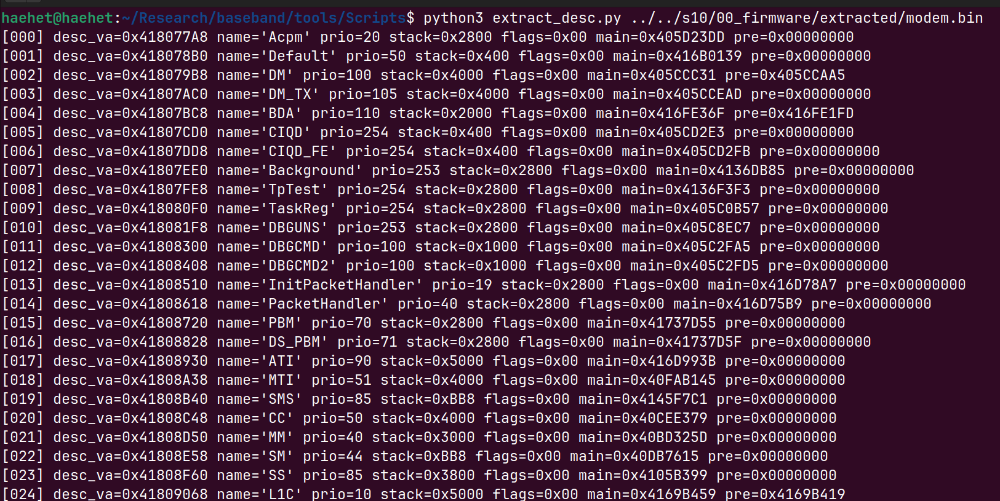

Shannon baseband firmware stores the information required to create each task in a static task descriptor table. In the previous analysis of `MainTask_entry()`, the process of traversing the descriptor table, creating tasks, sorting them according to priority, and registering them with the scheduler was examined.

In this analysis, the task descriptor table stored in the firmware image was parsed directly to extract information such as task names, priorities, stack sizes, and task entry addresses.

---

## Task Descriptor Region

The static task descriptor table begins at virtual address `0x418077A8`, and each descriptor is placed consecutively with a size of `0x108` bytes.

```text id="dqpztf"
Descriptor Table VA : 0x418077A8
Descriptor Size     : 0x108 bytes
Maximum Descriptor  : 500
```

The address of each descriptor can be calculated as follows.

```text id="f0bm05"
descriptor_va = 0x418077A8 + index * 0x108;
```

To read the data corresponding to a virtual address from the firmware file, the file offset was calculated as follows.

```text id="7fzuac"
file_offset = virtual_address - 0x4000DBE0;
```

Therefore, the file offset of the descriptor table is as follows.

```text id="clvk36"
DESC_OFF = 0x418077A8 - 0x4000DBE0;
```

The fields extracted from each descriptor are as follows.

| Offset  | Field        | Description                                                    |
| ------- | ------------ | -------------------------------------------------------------- |
| `+0x24` | Name Pointer | Virtual address of the task name string                        |
| `+0x28` | Priority     | Task scheduler priority                                        |
| `+0x2C` | Stack Size   | Size of the stack allocated to the task                        |
| `+0x30` | Main Entry   | Task main function pointer                                     |
| `+0x34` | Pre Entry    | Initialization function pointer executed before the main entry |
| `+0x09` | Flags        | Flags related to task creation and startup                     |

When a descriptor whose `Name Pointer` is `NULL` is encountered, it is considered to be the end of the static task descriptor table.

---

## Descriptor Extraction Script

The following Python script reads `modem.bin` and sequentially parses the static task descriptor region.

```python id="k50zll"
import argparse
import struct

parser = argparse.ArgumentParser(
    description="Extract Shannon task descriptors"
)
parser.add_argument(
    "bin",
    help="Path to modem.bin"
)
args = parser.parse_args()

BIN = args.bin

LOAD_BIAS = 0x4000DBE0
DESC_VA = 0x418077A8
DESC_OFF = DESC_VA - LOAD_BIAS
DESC_SIZE = 0x108
MAX_DESC = 500

def va_to_off(va):
    return va - LOAD_BIAS

def read_u32(data, off):
    return struct.unpack_from("<I", data, off)[0]

def read_cstr(data, va, max_len=128):
    if va == 0:
        return ""

    off = va_to_off(va)

    if off < 0 or off >= len(data):
        return f"<bad_va:0x{va:08X}>"

    end = off
    limit = min(len(data), off + max_len)

    while end < limit and data[end] != 0:
        end += 1

    return data[off:end].decode("ascii", errors="replace")

with open(BIN, "rb") as f:
    data = f.read()

for i in range(MAX_DESC):
    off = DESC_OFF + i * DESC_SIZE

    name_va = read_u32(data, off + 0x24)

    if name_va == 0:
        print(f"end at index {i}")
        break

    priority = read_u32(data, off + 0x28)
    stack_size = read_u32(data, off + 0x2C)
    main_entry = read_u32(data, off + 0x30)
    pre_entry = read_u32(data, off + 0x34)
    flags = data[off + 0x09]

    name = read_cstr(data, name_va)

    print(
        f"[{i:03d}] "
        f"desc_va=0x{DESC_VA + i * DESC_SIZE:08X} "
        f"name={name!r} "
        f"prio={priority} "
        f"stack=0x{stack_size:X} "
        f"flags=0x{flags:02X} "
        f"main=0x{main_entry:08X} "
        f"pre=0x{pre_entry:08X}"
    )
```

The script reads the descriptor's `Name Pointer` to recover the task name and prints the priority, stack size, flags, and entry function pointers stored in each descriptor.

It was executed by supplying the path to `modem.bin` as an argument, as follows.

```bash id="c6txmt"
python3 extract_desc.py \
    ../../s10/00_firmware/extracted/modem.bin
```

The descriptors were successfully extracted up to the `LOWEST` task at index `102`, and a descriptor whose `Name Pointer` was `NULL` was identified at index `103`.

```text id="zu71nk"
[102] desc_va=0x4180E0D8 name='LOWEST' ...
end at index 103
```

Therefore, this firmware contains a total of 103 static task descriptors.


---

## Task Descriptor List

| Index | desc_va    | Name              | Priority | Stack Size | Flags | Main Entry | Pre Entry  |
| ----- | ---------- | ----------------- | -------- | ---------- | ----- | ---------- | ---------- |
| 000   | 0x418077A8 | Acpm              | 20       | 0x2800     | 0x00  | 0x405D23DD | 0x00000000 |
| 001   | 0x418078B0 | Default           | 50       | 0x400      | 0x00  | 0x416B0139 | 0x00000000 |
| 002   | 0x418079B8 | DM                | 100      | 0x4000     | 0x00  | 0x405CCC31 | 0x405CCAA5 |
| 003   | 0x41807AC0 | DM_TX             | 105      | 0x4000     | 0x00  | 0x405CCEAD | 0x00000000 |
| 004   | 0x41807BC8 | BDA               | 110      | 0x2000     | 0x00  | 0x416FE36F | 0x416FE1FD |
| 005   | 0x41807CD0 | CIQD              | 254      | 0x400      | 0x00  | 0x405CD2E3 | 0x00000000 |
| 006   | 0x41807DD8 | CIQD_FE           | 254      | 0x400      | 0x00  | 0x405CD2FB | 0x00000000 |
| 007   | 0x41807EE0 | Background        | 253      | 0x2800     | 0x00  | 0x4136DB85 | 0x00000000 |
| 008   | 0x41807FE8 | TpTest            | 254      | 0x2800     | 0x00  | 0x4136F3F3 | 0x00000000 |
| 009   | 0x418080F0 | TaskReg           | 254      | 0x2800     | 0x00  | 0x405C0B57 | 0x00000000 |
| 010   | 0x418081F8 | DBGUNS            | 253      | 0x2800     | 0x00  | 0x405C8EC7 | 0x00000000 |
| 011   | 0x41808300 | DBGCMD            | 100      | 0x1000     | 0x00  | 0x405C2FA5 | 0x00000000 |
| 012   | 0x41808408 | DBGCMD2           | 100      | 0x1000     | 0x00  | 0x405C2FD5 | 0x00000000 |
| 013   | 0x41808510 | InitPacketHandler | 19       | 0x2800     | 0x00  | 0x416D78A7 | 0x00000000 |
| 014   | 0x41808618 | PacketHandler     | 40       | 0x2800     | 0x00  | 0x416D75B9 | 0x00000000 |
| 015   | 0x41808720 | PBM               | 70       | 0x2800     | 0x00  | 0x41737D55 | 0x00000000 |
| 016   | 0x41808828 | DS_PBM            | 71       | 0x2800     | 0x00  | 0x41737D5F | 0x00000000 |
| 017   | 0x41808930 | ATI               | 90       | 0x5000     | 0x00  | 0x416D993B | 0x00000000 |
| 018   | 0x41808A38 | MTI               | 51       | 0x4000     | 0x00  | 0x40FAB145 | 0x00000000 |
| 019   | 0x41808B40 | SMS               | 85       | 0xBB8      | 0x00  | 0x4145F7C1 | 0x00000000 |
| 020   | 0x41808C48 | CC                | 50       | 0x4000     | 0x00  | 0x40CEE379 | 0x00000000 |
| 021   | 0x41808D50 | MM                | 40       | 0x3000     | 0x00  | 0x40BD325D | 0x00000000 |
| 022   | 0x41808E58 | SM                | 44       | 0xBB8      | 0x00  | 0x40DB7615 | 0x00000000 |
| 023   | 0x41808F60 | SS                | 85       | 0x3800     | 0x00  | 0x4105B399 | 0x00000000 |
| 024   | 0x41809068 | L1C               | 10       | 0x5000     | 0x00  | 0x4169B459 | 0x4169B419 |
| 025   | 0x41809170 | PPP               | 80       | 0x1000     | 0x00  | 0x414B122D | 0x00000000 |
| 026   | 0x41809278 | GDA               | 25       | 0x2000     | 0x00  | 0x416D6915 | 0x00000000 |
| 027   | 0x41809380 | CDH               | 25       | 0x2000     | 0x00  | 0x41002753 | 0x00000000 |
| 028   | 0x41809488 | VSUP              | 52       | 0x400      | 0x00  | 0x416D229B | 0x00000000 |
| 029   | 0x41809590 | VCG               | 37       | 0xA800     | 0x00  | 0x407CF6BB | 0x00000000 |
| 030   | 0x41809698 | VCE               | 37       | 0x7800     | 0x00  | 0x407642AB | 0x00000000 |
| 031   | 0x418097A0 | SAEL3             | 50       | 0x10000    | 0x00  | 0x4166D857 | 0x00000000 |
| 032   | 0x418098A8 | DS_SAEL3          | 50       | 0x10000    | 0x00  | 0x4166DA19 | 0x00000000 |
| 033   | 0x418099B0 | PDNMGR            | 50       | 0x10000    | 0x00  | 0x41683673 | 0x00000000 |
| 034   | 0x41809AB8 | SIM               | 50       | 0xD000     | 0x00  | 0x40F18843 | 0x00000000 |
| 035   | 0x41809BC0 | DS_SIM            | 51       | 0xD000     | 0x00  | 0x40F1884F | 0x00000000 |
| 036   | 0x41809CC8 | LteRrm            | 38       | 0x10000    | 0x00  | 0x40F234BD | 0x00000000 |
| 037   | 0x41809DD0 | LTE_L1LC          | 37       | 0x10000    | 0x00  | 0x4083EB11 | 0x00000000 |
| 038   | 0x41809ED8 | LteRrc            | 42       | 0x10000    | 0x00  | 0x415C0735 | 0x00000000 |
| 039   | 0x41809FE0 | LteRrc_DS         | 42       | 0x10000    | 0x00  | 0x415C153D | 0x00000000 |
| 040   | 0x4180A0E8 | LTEL2LRx          | 6        | 0x10000    | 0x00  | 0x4087ABC7 | 0x00000000 |
| 041   | 0x4180A1F0 | LTEL2LTx          | 5        | 0x10000    | 0x00  | 0x40861AD7 | 0x00000000 |
| 042   | 0x4180A2F8 | LTEL2TCM          | 4        | 0x10000    | 0x00  | 0x0400A557 | 0x00000000 |
| 043   | 0x4180A400 | LTEL2IDLE         | 252      | 0x10000    | 0x00  | 0x0400A487 | 0x00000000 |
| 044   | 0x4180A508 | LTEL2HTx          | 39       | 0x10000    | 0x00  | 0x408900C5 | 0x00000000 |
| 045   | 0x4180A610 | LTEL2HRx          | 39       | 0x10000    | 0x00  | 0x4086369D | 0x00000000 |
| 046   | 0x4180A718 | LTE_TLP           | 39       | 0x2800     | 0x00  | 0x408B53F9 | 0x00000000 |
| 047   | 0x4180A820 | LTE_MTM           | 50       | 0x10000    | 0x00  | 0x40762BFD | 0x00000000 |
| 048   | 0x4180A928 | LTE_DM            | 254      | 0x10000    | 0x00  | 0x40B5FD21 | 0x00000000 |
| 049   | 0x4180AA30 | EDFS              | 20       | 0x14000    | 0x00  | 0x405D0367 | 0x405D02D7 |
| 050   | 0x4180AB38 | URRC              | 37       | 0x19000    | 0x00  | 0x40FA4591 | 0x00000000 |
| 051   | 0x4180AC40 | HSPA_CALIBRATION  | 10       | 0x5000     | 0x00  | 0x40D2EFAF | 0x00000000 |
| 052   | 0x4180AD48 | LLC               | 40       | 0x1000     | 0x00  | 0x4132F19D | 0x00000000 |
| 053   | 0x4180AE50 | GRR               | 25       | 0x2000     | 0x00  | 0x4169EF4D | 0x4169EF3B |
| 054   | 0x4180AF58 | RLC               | 25       | 0xC00      | 0x00  | 0x4169B7AD | 0x4169B789 |
| 055   | 0x4180B060 | GMAC              | 20       | 0xC00      | 0x00  | 0x4169B5C3 | 0x4169B59F |
| 056   | 0x4180B168 | GLAPD             | 20       | 0x9C4      | 0x00  | 0x4169DD33 | 0x4169DD31 |
| 057   | 0x4180B270 | SNDCP             | 50       | 0x1000     | 0x00  | 0x407D52E7 | 0x00000000 |
| 058   | 0x4180B378 | SRM               | 38       | 0x7800     | 0x00  | 0x41716A29 | 0x00000000 |
| 059   | 0x4180B480 | LCSM              | 80       | 0x7800     | 0x00  | 0x41753403 | 0x00000000 |
| 060   | 0x4180B588 | REG_SAP           | 48       | 0x1000     | 0x00  | 0x40578037 | 0x00000000 |
| 061   | 0x4180B690 | AS_SAP            | 52       | 0x800      | 0x00  | 0x40576E03 | 0x00000000 |
| 062   | 0x4180B798 | SMS_SAP           | 50       | 0x1000     | 0x00  | 0x4059DB73 | 0x00000000 |
| 063   | 0x4180B8A0 | CC_SS_SAP         | 50       | 0x800      | 0x00  | 0x405898F1 | 0x00000000 |
| 064   | 0x4180B9A8 | SIM_SAP           | 49       | 0x800      | 0x00  | 0x40578F87 | 0x00000000 |
| 065   | 0x4180BAB0 | DBG_SAP           | 53       | 0x1000     | 0x00  | 0x4062D12F | 0x00000000 |
| 066   | 0x4180BBB8 | DS_REG_SAP        | 48       | 0x1000     | 0x00  | 0x40578227 | 0x00000000 |
| 067   | 0x4180BCC0 | DS_AS_SAP         | 52       | 0x800      | 0x00  | 0x40576F41 | 0x00000000 |
| 068   | 0x4180BDC8 | DS_SMS_SAP        | 50       | 0x1000     | 0x00  | 0x4059DDAF | 0x00000000 |
| 069   | 0x4180BED0 | DS_CC_SS_SAP      | 50       | 0x800      | 0x00  | 0x40589B4D | 0x00000000 |
| 070   | 0x4180BFD8 | DS_SIM_SAP        | 49       | 0x800      | 0x00  | 0x405791E7 | 0x00000000 |
| 071   | 0x4180C0E0 | DS_DBG_SAP        | 53       | 0x1000     | 0x00  | 0x4062D2C5 | 0x00000000 |
| 072   | 0x4180C1E8 | MMC               | 51       | 0x10000    | 0x00  | 0x4057B3A1 | 0x00000000 |
| 073   | 0x4180C2F0 | MMC_IF            | 37       | 0x4000     | 0x00  | 0x4062D9CF | 0x00000000 |
| 074   | 0x4180C3F8 | SR_IF             | 9        | 0x4000     | 0x00  | 0x4063BC55 | 0x00000000 |
| 075   | 0x4180C500 | LTE_MMC_GL1       | 37       | 0x4000     | 0x00  | 0x4178C7AD | 0x00000000 |
| 076   | 0x4180C608 | USAT              | 70       | 0x4000     | 0x00  | 0x4171EE3F | 0x00000000 |
| 077   | 0x4180C710 | DS_USAT           | 71       | 0x4000     | 0x00  | 0x4171EE49 | 0x00000000 |
| 078   | 0x4180C818 | LTE_TCPIP         | 39       | 0x10000    | 0x00  | 0x40682AA9 | 0x00000000 |
| 079   | 0x4180C920 | LTE_SISO_ASYNC    | 39       | 0x10000    | 0x00  | 0x40682AA7 | 0x00000000 |
| 080   | 0x4180CA28 | IMS_CC            | 52       | 0xA000     | 0x00  | 0x406648C9 | 0x00000000 |
| 081   | 0x4180CB30 | LPP               | 50       | 0x10000    | 0x00  | 0x4168276B | 0x00000000 |
| 082   | 0x4180CC38 | SHM               | 38       | 0x800      | 0x00  | 0x413FFA51 | 0x00000000 |
| 083   | 0x4180CD40 | UL2CC             | 18       | 0xF000     | 0x00  | 0x40FD1515 | 0x40FD1485 |
| 084   | 0x4180CE48 | UL2DL             | 23       | 0xF000     | 0x00  | 0x41070AB5 | 0x41070A6B |
| 085   | 0x4180CF50 | UL2UL             | 24       | 0xF000     | 0x00  | 0x40D3918D | 0x40D39157 |
| 086   | 0x4180D058 | UDATA             | 25       | 0xF000     | 0x00  | 0x410981A3 | 0x4109815F |
| 087   | 0x4180D160 | UBMCTask          | 26       | 0xF000     | 0x00  | 0x40FDD321 | 0x40FDD30F |
| 088   | 0x4180D268 | ephyFramework     | 100      | 0x1000     | 0x04  | 0x4168FF29 | 0x00000000 |
| 089   | 0x4180D370 | syncTask          | 50       | 0x400      | 0x04  | 0x41690BC9 | 0x00000000 |
| 090   | 0x4180D478 | recMailTask       | 40       | 0x400      | 0x04  | 0x41690C25 | 0x00000000 |
| 091   | 0x4180D580 | sendMailTask      | 50       | 0x400      | 0x04  | 0x41690C4F | 0x00000000 |
| 092   | 0x4180D688 | BTL               | 254      | 0x2800     | 0x00  | 0x40B97FD7 | 0x40B97B13 |
| 093   | 0x4180D790 | CLM               | 100      | 0x10000    | 0x00  | 0x4091CB73 | 0x00000000 |
| 094   | 0x4180D898 | CLTCP             | 250      | 0x1000     | 0x00  | 0x40909B3D | 0x00000000 |
| 095   | 0x4180D9A0 | SecuCh            | 110      | 0x2000     | 0x00  | 0x4107D951 | 0x4107D8BB |
| 096   | 0x4180DAA8 | SHUB_MSG          | 220      | 0x4000     | 0x00  | 0x40922BA9 | 0x00000000 |
| 097   | 0x4180DBB0 | SSH               | 230      | 0x4000     | 0x00  | 0x409164B1 | 0x00000000 |
| 098   | 0x4180DCB8 | CPCOP             | 240      | 0x4000     | 0x00  | 0x4090A191 | 0x00000000 |
| 099   | 0x4180DDC0 | PROXIMITY         | 240      | 0x4000     | 0x00  | 0x4090DB03 | 0x00000000 |
| 100   | 0x4180DEC8 | CMMO              | 250      | 0x4000     | 0x00  | 0x408FA2C1 | 0x00000000 |
| 101   | 0x4180DFD0 | CPR               | 5        | 0x1000     | 0x00  | 0x4136FA7F | 0x00000000 |
| 102   | 0x4180E0D8 | LOWEST            | 255      | 0x800      | 0x00  | 0x4136FCD1 | 0x00000000 |

---

## Extraction Results

A total of 103 tasks were identified in the static task descriptor table.

The task names show that multiple tasks forming the LTE, GSM, and UMTS protocol stacks exist independently.

Representative LTE-related tasks include the following.

```text id="ozf76k"
LTE_L1LC
LteRrm
LteRrc
LTEL2LRx
LTEL2LTx
LTEL2TCM
LTEL2HTx
LTEL2HRx
LTE_TLP
LTE_MTM
LTE_TCPIP
```

The following tasks were identified in the GSM and UMTS families.

```text id="ftn9cq"
L1C
GRR
RLC
GMAC
GLAPD
SNDCP
URRC
UL2CC
UL2DL
UL2UL
UDATA
```

Separate SAP tasks such as `REG_SAP`, `AS_SAP`, `SMS_SAP`, and `SIM_SAP` also exist, and multiple dual-SIM tasks with the `DS_` prefix were identified.

Most descriptors have a `flags` value of `0x00`, but `0x04` is set for the following four tasks.

```text id="hp0dnh"
ephyFramework
syncTask
recMailTask
sendMailTask
```

According to the condition identified during the previous static task creation analysis, a task with this flag is not immediately resumed during the initial startup stage even after its descriptor has been created.

For tasks with a configured `Pre Entry`, the common task entry wrapper executes a separate initialization routine before calling the `Main Entry`.

```text id="9it5lv"
DM
BDA
L1C
EDFS
GRR
RLC
GMAC
GLAPD
UL2CC
UL2DL
UL2UL
UDATA
UBMCTask
BTL
SecuCh
```

The task names and entry addresses extracted in this analysis can be used as a reference when analyzing the message framework to determine the RTOS task in which each message handler is executed.
