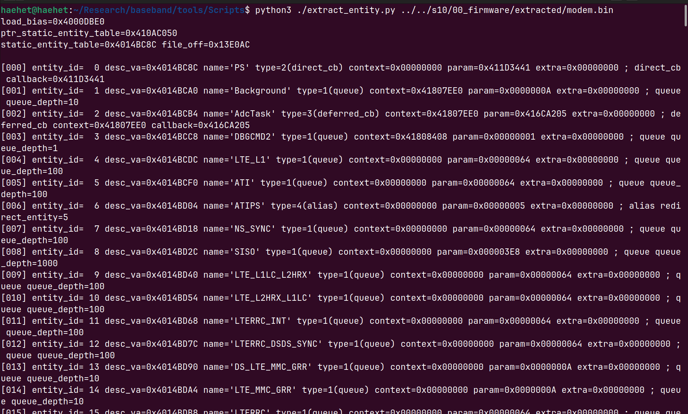

The previous analysis extracted the statically registered Task Descriptors and reconstructed execution information such as each task's name, entry point, priority, and stack size. This analysis examines the PAL Message Entity and Queue structures used by those tasks to reconstruct the inter-task IPC flow inside the Shannon baseband.

---

## pal_MsgSubsystem_Init

While tracing the execution flow of `MainTask_entry()`, the initialization of the major PAL runtime subsystems inside `pal_Init1()` was examined. At that time, a message-system-related function named `pal_msg__Background` was identified but not analyzed further. After analyzing its internal behavior and call relationships, the function was renamed to `pal_MsgSubsystem_Init`.

`pal_MsgSubsystem_Init()` first initializes the PAL Queue Subsystem and then copies the Message Entity Descriptors statically defined in the firmware into the runtime Entity Table. It creates and associates actual queues with queue-backed entities and finally stores the number of registered entities in the global subsystem state.

```c id="ftdxkn"
/* Setting prototype: int pal_MsgSubsystem_Init(void) */

int pal_MsgSubsystem_Init(void)

{
  int aux_or_queue_depth;
  uint item_count;
  uint entity_name_or_id;
  uint in_r3;
  int count;
  pal_msg_entity *entity;
  uint queue_id;
  int msg_entity_table;
  int *static_entity_table;
  byte type;
  
                    /* Initialize PAL message subsystem: initialize queue pool, copy static message
                       entity descriptors into runtime table, create queues for queue-backed entity
                       types 1 and 5, and store entity count in manager state. */
  queue_id = in_r3;
  pal_QueueSubsystem_Init();
  msg_entity_table = PTR_g_palMsgEntityTable;
  static_entity_table = PTR_g_palMsgStaticEntityTable;
  count = 0;
  if (*PTR_g_palMsgStaticEntityTable != 0) {
    while( true ) {
      entity_name_or_id = static_entity_table[count * 5];
      entity = (pal_msg_entity *)(msg_entity_table + count * 0x14);
      *(uint *)(msg_entity_table + count * 0x14) = entity_name_or_id;
      entity->context = static_entity_table[count * 5 + 1];
      type = *(byte *)(static_entity_table + count * 5 + 2);
      entity->entity_type = type;
      item_count = static_entity_table[count * 5 + 3];
      entity->queue_depth = item_count;
      if (type == 1 || type == 5) {
        queue_id = 0;
        pal_QueueCreate(&queue_id,item_count,entity_name_or_id);
        entity->queue_id = queue_id;
      }
      if (((char)static_entity_table[count * 5 + 2] == '\x03') &&
         (static_entity_table[count * 5 + 1] == 0)) {
        pal_FatalAssert(0x11,PTR_palMsgSourceFile,0x7b);
      }
      count = count + 1;
      if (static_entity_table[count * 5] == 0) break;
      if (499 < count) {
                    /* Runtime PAL message entity entry size is 0x14. Static entries are copied from
                       a 5-dword descriptor table. */
        pal_FatalAssert(0x14,PTR_palMsgSourceFile,0x67);
      }
    }
  }
  aux_or_queue_depth = _DAT_410ac05c;
  *(int *)(_DAT_410ac05c + 8) = count;
  *(int *)(aux_or_queue_depth + 0xc) = count;
  for (; count < 500; count = count + 1) {
    *(undefined4 *)(msg_entity_table + count * 0x14) = 0;
    aux_or_queue_depth = msg_entity_table + count * 0x14;
    *(undefined4 *)(aux_or_queue_depth + 4) = 0;
    *(undefined1 *)(aux_or_queue_depth + 8) = 0;
    *(undefined4 *)(aux_or_queue_depth + 0xc) = 0xffffffff;
  }
  return 0;
}
```

Before registering the Message Entities, `pal_MsgSubsystem_Init()` first initializes the PAL Queue Subsystem.

```c id="qybg8m"
pal_QueueSubsystem_Init();
```

The PAL Message System manages logical message destinations as `Message Entity` objects. However, for a queue-backed entity to store messages and allow a task to receive them, a queue object associated with that entity must first be prepared.

`pal_QueueSubsystem_Init()` constructs the global pool that stores and manages the Queue Descriptors required when individual queues are later created.

```c id="frwtb4"
/* Setting prototype: void pal_QueueSubsystem_Init(void) */

void pal_QueueSubsystem_Init(void)

{
  pal_queue *queue_desc_table;
  uint index;
  uint count;
  
  g_palQueuePool.max_queue_count = 550;
  queue_desc_table =
       (pal_queue *)
       pal_MemAllocDebug(1,&DAT_00006fb8,
                         "../../../VARIANT/PALVar/Platform_EV/PAL/MessageTransport/src/pal_queue.c",
                         0x6f);
  g_palQueuePool.queue_desc_table = queue_desc_table;
  if ((queue_desc_table != (pal_queue *)0x0) && (index = 0, g_palQueuePool.max_queue_count != 0)) {
    do {
      count = index + 1;
      queue_desc_table[index].ring_buffer_alloc = (pal_msg *)0x0;
      index = count;
    } while (count < g_palQueuePool.max_queue_count);
  }
  return;
}
```

The function sets the maximum number of queues to `550` and allocates a contiguous memory region that stores all Queue Descriptors.

```c id="13pp83"
g_palQueuePool.max_queue_count = 550;
```

It then calls `pal_MemAllocDebug()` to create the Queue Descriptor Table and stores the returned address in the global Queue Pool.

```c id="rm7brm"
ppVar1 = (pal_queue *)
    pal_MemAllocDebug(
        1,
        &DAT_00006fb8,
        "../../../VARIANT/PALVar/Platform_EV/PAL/"
        "MessageTransport/src/pal_queue.c",
        0x6f
    );

g_palQueuePool.queue_desc_table = ppVar1;
```

Ghidra displays the second argument as `&DAT_00006fb8`, but it is actually the allocation size, `0x6FB8`. This is something that should be handled carefully when analyzing the RTOS.

```c id="nf7nwx"
0x6FB8 = 28,600 bytes
```

Because the maximum number of Queue Descriptors is 550, the size of one `pal_queue` structure can be calculated as follows.

```c id="4wp74c"
0x6FB8 ÷ 550 = 0x34 bytes
```

Therefore, the Queue Descriptor Table has the following layout.

```text id="tw1dit"
g_palQueuePool.queue_desc_table
 │
 ├─ pal_queue[0]      // 0x34 bytes
 ├─ pal_queue[1]      // 0x34 bytes
 ├─ pal_queue[2]
 ├─ ...
 └─ pal_queue[549]
```

The Queue Pool structure reconstructed so far is as follows.

```c id="l7hydo"
typedef struct pal_queue_pool {
    uint32_t   max_queue_count;
    pal_queue *queue_desc_table;
} pal_queue_pool;
```

If allocation of the Descriptor Table succeeds, the function iterates through all 550 `pal_queue` entries and initializes the `ring_buffer_alloc` field to `NULL`.

```c id="uhfmm3"
for (uint32_t i = 0;
     i < g_palQueuePool.max_queue_count;
     i++) {

    g_palQueuePool.queue_desc_table[i]
        .ring_buffer_alloc = NULL;
}
```

Based on the location of the initialized field, `pal_queue` can be reconstructed as follows.

```c id="pxypgy"
typedef struct pal_queue {
    pal_msg     *ring_buffer_alloc;  // +0x00
    pal_os_queue os_queue;           // +0x04
} pal_queue;
```

Because the total size of `pal_queue` is `0x34` bytes and the first pointer occupies 4 bytes, the embedded `pal_os_queue` structure has a size of `0x30` bytes.

`ring_buffer_alloc` stores the allocated address of the message ring buffer used by the queue. During initialization, no individual queue has yet been created, so this pointer is set to `NULL` in every descriptor.

After Queue Subsystem initialization is complete, `pal_MsgSubsystem_Init()` obtains the addresses of the Static Message Entity Table and Runtime Message Entity Table.

```c id="bknja0"
msg_entity_table = PTR_g_palMsgEntityTable;
static_entity_table = PTR_g_palMsgStaticEntityTable;
count = 0;
```

The Static Entity Table stores the Message Entity configuration defined when the firmware was built, while the Runtime Entity Table stores the information actually used for message transmission and reception after boot.

The function then iterates through the Static Entity Table and copies the fields of each descriptor into the Runtime Entity Table.

```c id="tasy4k"
entity_name_or_id = static_entity_table[count * 5];

entity =
    (pal_msg_entity *)
    (msg_entity_table + count * 0x14);

*(uint *)(msg_entity_table + count * 0x14) =
    entity_name_or_id;

entity->context =
    static_entity_table[count * 5 + 1];

type =
    *(byte *)(static_entity_table + count * 5 + 2);

entity->entity_type = type;

item_count =
    static_entity_table[count * 5 + 3];

entity->queue_depth = item_count;
```

Each Static Descriptor contains `5 DWORDs`, or 20 bytes, and Runtime Entities are accessed at intervals of `count * 0x14`. Therefore, both entries have a size of `0x14` bytes.

Based on the current analysis, the Runtime Message Entity structure can be reconstructed as follows.

```c id="sy8q0l"
typedef struct pal_msg_entity {
    uint32_t entity_name_or_id;  // +0x00
    uint32_t context;            // +0x04
    uint8_t  entity_type;        // +0x08
    uint8_t  reserved[3];        // +0x09
    uint32_t queue_depth;        // +0x0C
    uint32_t queue_id;           // +0x10
} pal_msg_entity;                // size: 0x14
```

A `pal_msg_entity` represents a logical message destination. The meanings of fields such as `context`, `queue_depth`, and `queue_id` can vary depending on the Entity Type. For queue-backed entities, however, `queue_depth` and `queue_id` associate the logical entity with an actual PAL Queue.

If the Entity Type is `1` or `5`, a queue is created for the entity.

```c id="cp3xwh"
if (type == 1 || type == 5) {
    queue_id = 0;

    pal_QueueCreate(
        &queue_id,
        item_count,
        entity_name_or_id
    );

    entity->queue_id = queue_id;
}
```

`pal_QueueSubsystem_Init()` previously prepared only the Queue Descriptor Pool. The `pal_QueueCreate()` call in this section creates an actual queue using the Queue Depth stored in the Static Descriptor and stores the returned Queue ID in the `+0x10` field of the Runtime Entity.

```text id="jb8bqa"
pal_msg_entity
    └─ queue_id
         └─ g_palQueuePool.queue_desc_table[queue_id]
```

Therefore, for Types 1 and 5, the `+0x0C` field can be interpreted as the number of items that can be stored in the queue, or the Queue Depth.

For Entity Type `3`, the function verifies that a Context exists.

```c id="kxmpnh"
if (((char)static_entity_table[count * 5 + 2] == '\x03') &&
    (static_entity_table[count * 5 + 1] == 0)) {

    pal_FatalAssert(
        0x11,
        PTR_palMsgSourceFile,
        0x7b
    );
}
```

Type 3 uses a Context and Callback instead of a queue. Therefore, if no Context is configured, a fatal assertion occurs during initialization.

After each Entity is initialized, `count` is incremented, and the first field of the next descriptor is checked.

```c id="4l4wgt"
count = count + 1;

if (static_entity_table[count * 5] == 0)
    break;
```

If the first field is `0`, it is considered the end of the Static Entity Table. The Runtime Entity Table supports a maximum of 500 entries, and a fatal assertion occurs if that limit is exceeded.

```c id="dtu0jn"
if (499 < count) {
    pal_FatalAssert(
        0x14,
        PTR_palMsgSourceFile,
        0x67
    );
}
```

After traversal of the Static Entities is complete, the number of registered Entities is stored in the global state of the Message Subsystem.

```c id="bxtnsj"
*(int *)(_DAT_410ac05c + 8) = count;
*(int *)(_DAT_410ac05c + 0xc) = count;
```

The exact difference between these two fields requires additional analysis, but both are initialized to the number of registered Runtime Entities.

Finally, the unused slots in the Runtime Entity Table are initialized.

```c id="a0sbyu"
for (; count < 500; count = count + 1) {
    *(undefined4 *)(msg_entity_table + count * 0x14) = 0;

    aux_or_queue_depth =
        msg_entity_table + count * 0x14;

    *(undefined4 *)(aux_or_queue_depth + 4) = 0;
    *(undefined1 *)(aux_or_queue_depth + 8) = 0;
    *(undefined4 *)(aux_or_queue_depth + 0xc) = 0xffffffff;
}
```

Expressed using the reconstructed structure, the initialization is as follows.

```c id="rz54l7"
entity->entity_name_or_id = 0;
entity->context = 0;
entity->entity_type = 0;
entity->queue_depth = 0xffffffff;
```

As a result, `pal_MsgSubsystem_Init()` converts the statically defined Message Entity Descriptors into `0x14`-byte Runtime Entities and associates queue-backed Entities with actual Queue IDs. This constructs the PAL Message IPC structure later used by `pal_MsgSend()` and `pal_MsgReceive()`.

---

### pal_QueueCreate

If an Entity Type is `1` or `5`, `pal_MsgSubsystem_Init()` calls `pal_QueueCreate()` to create the queue used by that Entity.

```c id="b2kpb2"
if (type == 1 || type == 5) {
    queue_id = 0;
    pal_QueueCreate(&queue_id, item_count, entity_name_or_id);
    entity->queue_id = queue_id;
}
```

The decompiled result of `pal_QueueCreate()` is as follows.

```c id="itn33u"
/* Setting prototype: int pal_QueueCreate(uint *out_queue_id, int item_count, uint name_or_flags) */

int pal_QueueCreate(uint *out_queue_id,int item_count,uint name_or_flags)

{
  pal_queue *ppVar1;
  pal_queue *ppVar2;
  int iVar3;
  pal_msg *ring_buffer;
  uint count;
  
  count = 0;
  if (g_palQueuePool.max_queue_count != 0) {
    do {
      if (g_palQueuePool.queue_desc_table[count].ring_buffer_alloc == (pal_msg *)0x0) break;
      count = count + 1;
    } while (count < g_palQueuePool.max_queue_count);
  }
  if (count == g_palQueuePool.max_queue_count) {
    pal_FatalAssert(0xfffff506,
                    "../../../VARIANT/PALVar/Platform_EV/PAL/MessageTransport/src/pal_queue.c",0x95)
    ;
    iVar3 = -0xafa;
  }
  else {
    *out_queue_id = count;
    ring_buffer = (pal_msg *)
                  pal_MemAllocDebug(1,item_count << 3,
                                    "../../../VARIANT/PALVar/Platform_EV/PAL/MessageTransport/src/pa l_queue.c"
                                    ,0x9a);
    ppVar2 = g_palQueuePool.queue_desc_table;
    g_palQueuePool.queue_desc_table[count].ring_buffer_alloc = ring_buffer;
    ppVar2[count].os_queue.list_next = (pal_os_queue *)0x0;
    ppVar2[count].os_queue.list_prev = (pal_os_queue *)0x0;
    ppVar1 = ppVar2 + count;
    (ppVar1->os_queue).object_type = 0;
    (ppVar1->os_queue).reserved_09[0] = 0;
    (ppVar1->os_queue).reserved_09[1] = 0;
    (ppVar1->os_queue).reserved_09[2] = 0;
    ppVar2[count].os_queue.waiting_task_id = 0;
    ppVar2[count].os_queue.read_index = 0;
    ppVar2[count].os_queue.write_index = 0;
    ppVar2[count].os_queue.ring_buffer = (pal_msg *)0x0;
    ppVar2[count].os_queue.ring_word_capacity = 0;
    ppVar2[count].os_queue.used_item_count = 0;
    ppVar1 = ppVar2 + count;
    (ppVar1->os_queue).name[0] = '\0';
    (ppVar1->os_queue).name[1] = '\0';
    (ppVar1->os_queue).name[2] = '\0';
    (ppVar1->os_queue).name[3] = '\0';
    ppVar1 = ppVar2 + count;
    (ppVar1->os_queue).name[4] = '\0';
    (ppVar1->os_queue).name[5] = '\0';
    (ppVar1->os_queue).name[6] = '\0';
    (ppVar1->os_queue).name[7] = '\0';
    ppVar2[count].os_queue.reserved_28 = 0;
    ppVar2[count].os_queue.delete_callback = (void *)0x0;
    iVar3 = OS_CreateQueue_DW(&ppVar2[count].os_queue,name_or_flags,ring_buffer,item_count << 1,7,2,
                              (void *)0x6);
    iVar3 = (int)(short)iVar3;
    if (iVar3 != 0) {
      FUN_40cc91d4(g_palQueuePool.queue_desc_table + count,
                   "../../../VARIANT/PALVar/Platform_EV/PAL/MessageTransport/src/pal_queue.c",0xad);
      g_palQueuePool.queue_desc_table[count].ring_buffer_alloc = (pal_msg *)0x0;
      pal_FatalAssert(iVar3,
                      "../../../VARIANT/PALVar/Platform_EV/PAL/MessageTransport/src/pal_queue.c",
                      0xaf);
      return iVar3;
    }
    iVar3 = 0;
  }
  return iVar3;
}
```

The function first traverses the Queue Descriptor Table and searches for an entry whose `ring_buffer_alloc` field is `NULL`.

```c id="bdnjcw"
if (g_palQueuePool.queue_desc_table[count]
        .ring_buffer_alloc == NULL)
    break;
```

This explains why `pal_QueueSubsystem_Init()` initialized the `ring_buffer_alloc` field of every Descriptor to `NULL`. The field indicates whether a Queue Descriptor is currently in use.

```text id="bjqjlb"
ring_buffer_alloc == NULL
    → Unused Queue Descriptor

ring_buffer_alloc != NULL
    → Queue already created
```

When an available Descriptor is found, its array index is returned as the Queue ID.

```c id="xrzsbq"
*out_queue_id = count;
```

Therefore, a PAL `queue_id` is not a separate object number. It is an index into `g_palQueuePool.queue_desc_table`.

```c id="crld2v"
pal_queue *queue =
    &g_palQueuePool.queue_desc_table[queue_id];
```

If no available Descriptor exists, the Queue Pool is considered full, and a fatal assertion occurs.

```c id="khjwau"
if (count == g_palQueuePool.max_queue_count) {
    pal_FatalAssert(...);
    return -0xafa;
}
```

Once the Queue Descriptor to use has been selected, a Ring Buffer is allocated to store messages.

```c id="pncsgl"
ring_buffer = (pal_msg *)
    pal_MemAllocDebug(
        1,
        item_count << 3,
        ...,
        0x9a
    );
```

The allocation size, `item_count << 3`, is equivalent to the following.

```text id="r0tncq"
item_count × 8 bytes
```

Therefore, each message entry stored in the queue has a size of 8 bytes.

```c id="tyj1re"
typedef struct pal_msg {
    uint32_t msg_type;  // +0x00
    void    *msg_ptr;   // +0x04
} pal_msg;              // size: 0x08
```

The entire upper-protocol payload is not copied into the queue. Instead, only a small structure containing the message type and payload address is stored.

```text id="g3pxui"
pal_msg
 ├─ msg_type
 └─ msg_ptr → Actual payload
```

The allocated address is stored in the `ring_buffer_alloc` field of the selected `pal_queue` Descriptor.

```c id="2s8wp7"
g_palQueuePool.queue_desc_table[count]
    .ring_buffer_alloc = ring_buffer;
```

After Ring Buffer allocation, the embedded `pal_os_queue` structure is initialized.

```c id="401nvf"
os_queue.list_next = NULL;
os_queue.list_prev = NULL;
os_queue.object_type = 0;
os_queue.waiting_task_id = 0;

os_queue.read_index = 0;
os_queue.write_index = 0;

os_queue.ring_buffer = NULL;
os_queue.ring_word_capacity = 0;
os_queue.used_item_count = 0;

memset(os_queue.name, 0, 8);

os_queue.reserved_28 = 0;
os_queue.delete_callback = NULL;
```

`ring_buffer_alloc` contains the original address of the Ring Buffer allocated by PAL and also indicates whether the Queue Descriptor is in use. The embedded `pal_os_queue` manages the state required for actual queue operation, including the read and write indices, current item count, and waiting task ID.

After structure initialization is complete, `OS_CreateQueue_DW()` is called to create the actual OS Queue object.

```c id="krh5v1"
iVar3 = OS_CreateQueue_DW(
    &queue_desc_table[count].os_queue,
    name_or_flags,
    ring_buffer,
    item_count << 1,
    7,
    2,
    (void *)0x6
);
```

Although the Ring Buffer was allocated with a size of `item_count × 8` bytes, the capacity passed to the OS Queue creation function is `item_count << 1`.

Therefore, `OS_CreateQueue_DW()` appears to receive the Ring Buffer size in words rather than bytes.

`OS_CreateQueue_DW()` initializes the actual OS Queue object using the total Ring Buffer size and the Queue Item size.

```c id="4ykx01"
int OS_CreateQueue_DW(pal_os_queue *queue,uint name_or_flags,pal_msg *ring_buffer,
                     int ring_word_count,int item_dword_size,int object_type,void *delete_callback)

{
  OS_QueueObjectInit(queue,name_or_flags,ring_buffer,object_type & 0xffff,
                     (uint)ring_word_count / (uint)object_type & 0xffff,(void *)0x0);
  return 0;
}
```

The actual Queue structure initialization is performed by `OS_QueueObjectInit()`.

```c id="6kuxuk"
int OS_QueueObjectInit(
    pal_os_queue *queue,
    uint name_or_flags,
    pal_msg *ring_buffer,
    int item_word_size,
    int item_count,
    void *delete_callback
)

{
  undefined4 irq_state;
  undefined4 queue_list;

  irq_state = disable_interrupt();

  MemCopy(queue->name, name_or_flags);

  queue->object_type = 3;
  queue->waiting_task_id = 0;
  queue->read_index = 0;
  queue->write_index = 0;
  queue->ring_buffer = ring_buffer;
  queue->used_item_count = 0;
  queue->delete_callback = delete_callback;
  queue->reserved_28 = 0;

  queue->ring_word_capacity =
      item_word_size * item_count;

  queue_list = DAT_4178ed28;
  List_AppendTail(queue_list, queue);

  RestoreInterrupts(irq_state);

  return 0;
}
```

The function first disables interrupts and then stores the Queue name and Ring Buffer address. It initializes the read and write indices and the current item count to `0`.

```c id="iu6uiq"
queue->read_index = 0;
queue->write_index = 0;
queue->used_item_count = 0;
queue->ring_buffer = ring_buffer;
```

The total Queue capacity is stored in word units.

```c id="7wpptr"
queue->ring_word_capacity =
    item_word_size * item_count;
```

For the current call, one item contains 2 words, and the item count is `item_count`.

```text id="2flpyk"
ring_word_capacity
    = 2 × item_count
    = item_count × 8 bytes
```

In addition, `queue->object_type` is not assigned from the external argument. It is set to `3` inside `OS_QueueObjectInit()`.

```c id="ld7v4l"
queue->object_type = 3;
```

Once initialization is complete, the Queue is registered in the global OS Queue List through `List_AppendTail()`. This process is performed while interrupts are disabled to prevent another task or IRQ from modifying the Queue List at the same time.

As a result, `OS_CreateQueue_DW()` and `OS_QueueObjectInit()` connect the `pal_msg` Ring Buffer allocated by PAL to an actual OS Queue object, initialize the Queue indices, capacity, and waiting-task state, and register the Queue in the global Queue List.

If `OS_CreateQueue_DW()` fails, the allocated Queue resources are cleaned up, and the Descriptor is returned to the unused state.

```c id="mcvmzx"
if (iVar3 != 0) {
    FUN_40cc91d4(
        g_palQueuePool.queue_desc_table + count,
        ...,
        0xad
    );

    g_palQueuePool.queue_desc_table[count]
        .ring_buffer_alloc = NULL;

    pal_FatalAssert(iVar3, ..., 0xaf);

    return iVar3;
}
```

In particular, because `ring_buffer_alloc` is set back to `NULL`, the Descriptor can be selected again by a later Queue creation operation.

If Queue creation succeeds, the function returns `0`, and the generated Queue ID is passed to the caller through `out_queue_id`.

As a result, `pal_QueueCreate()` selects an unused Queue Descriptor, allocates a Ring Buffer for the `pal_msg` array, and creates the embedded OS Queue.

```text id="bix4vk"
pal_QueueCreate
    → Search for an unused Descriptor
    → Return Queue ID
    → Allocate pal_msg Ring Buffer
    → Initialize pal_os_queue
    → Create OS Queue
```

The generated Queue ID is then stored in the Runtime Message Entity to connect the logical Message Entity with the actual Queue object.

```c id="zu0x3r"
entity->queue_id = queue_id;
```

## pal_MsgReceive

Each task calls `pal_MsgReceive()` to remove a message from its Queue.

```c id="jdugm9"
int pal_MsgReceive(int recv_id,void **msg,uint8_t *msg_type,int wait)

{
  int iVar1;
  pal_msg_entity *entity;
  uint msg_type_tmp;
  char entity_type;
  
  *msg = (void *)0x0;
  if (msg_type != (uint8_t *)0x0) {
    *msg_type = '\0';
  }
  iVar1 = PTR_palMsgReceiveError_410ac098;
  entity_type = *(char *)(PTR_g_palMsgEntityTable + recv_id * 0x14 + 8);
  while (entity_type == '\x04') {
    recv_id = *(int *)(PTR_g_palMsgEntityTable + recv_id * 0x14 + 0xc);
    entity_type = *(char *)(PTR_g_palMsgEntityTable + recv_id * 0x14 + 8);
  }
  entity = (pal_msg_entity *)(PTR_g_palMsgEntityTable + recv_id * 0x14);
  msg_type_tmp = wait;
  if (entity->entity_type == 1 || entity->entity_type == 5) {
    iVar1 = pal_QueueReceive(entity->queue_id,&msg_type_tmp,msg,wait);
    if ((iVar1 == 0) && (msg_type != (uint8_t *)0x0)) {
      *msg_type = (uint8_t)msg_type_tmp;
      return 0;
    }
  }
  else {
    pal_FatalAssert(PTR_palMsgReceiveError_410ac098,PTR_palMsgSourceFile,0x283);
  }
  return iVar1;
}
```

The function first initializes the output variables.

```c id="aa8c95"
*msg = NULL;

if (msg_type != NULL) {
    *msg_type = 0;
}
```

`recv_id` is directly used as an array index into the Runtime Message Entity Table.

```c id="76ug7c"
entity =
    (pal_msg_entity *)
    (PTR_g_palMsgEntityTable + recv_id * 0x14);
```

Because one `pal_msg_entity` has a size of `0x14` bytes, this is equivalent to the following access.

```c id="q1klg5"
entity = &g_palMsgEntityTable[recv_id];
```

If the Entity Type is `4`, the `+0x0C` field of the current Entity is used as the new Entity ID.

```c id="rj4pr7"
while (entity_type == 4) {
    recv_id =
        *(int *)(PTR_g_palMsgEntityTable +
                 recv_id * 0x14 + 0xc);

    entity_type =
        *(char *)(PTR_g_palMsgEntityTable +
                  recv_id * 0x14 + 8);
}
```

Therefore, Type 4 is not an Entity with its own Queue. It is a Redirect or Alias Endpoint that points to another Entity.

For queue-backed Types 1 and 5, `+0x0C` is used as the Queue Depth. For Type 4, the same field is used as the destination Entity ID.

After redirect processing is complete, if the final Entity Type is `1` or `5`, a message is received from the Queue associated with that Entity.

```c id="x91jj7"
if (entity->entity_type == 1 ||
    entity->entity_type == 5) {

    result = pal_QueueReceive(
        entity->queue_id,
        &msg_type_tmp,
        msg,
        wait
    );
}
```

The `queue_id` stored in the Runtime Entity is an index into the Queue Descriptor Table returned by `pal_QueueCreate()`.

```text id="bkgy8q"
recv_id
    → g_palMsgEntityTable[recv_id]
    → entity->queue_id
    → g_palQueuePool.queue_desc_table[queue_id]
```

If Queue reception succeeds, the low byte of the Message Type stored in the temporary variable is returned to the caller.

```c id="vbfbmk"
if ((result == 0) && (msg_type != NULL)) {
    *msg_type = (uint8_t)msg_type_tmp;
}
```

If the final Entity is not Type 1 or Type 5, it is considered not to support Queue reception, and a fatal assertion occurs.

---

### pal_QueueReceive

`pal_QueueReceive()` validates the supplied Queue ID and then passes execution to the actual OS Queue receive function.

```c id="fy7ogd"
int pal_QueueReceive(
    uint queue_id,
    uint *msg_type,
    void **msg,
    int wait
)

{
  int result;
  int os_result;

  if (queue_id < g_palQueuePool.max_queue_count) {

    if (g_palQueuePool.queue_desc_table[queue_id]
            .ring_buffer_alloc == NULL) {

      pal_FatalAssert(
          0xfffff506,
          "../../../VARIANT/PALVar/Platform_EV/PAL/"
          "MessageTransport/src/pal_queue.c",
          0x1a5
      );

      return -0xafa;
    }

    os_result = OS_Receive_From_Queue_DW(
        &g_palQueuePool.queue_desc_table[queue_id].os_queue,
        msg,
        msg_type,
        (uint)(wait != 0)
    );

    os_result = (int)(short)os_result;

    if (os_result == 0xa2) {
      result = 5;
    }
    else {
      result = 0;

      if (os_result != 0) {
        *msg_type = 0;
        *msg = NULL;

        pal_FatalAssert(
            os_result,
            "../../../VARIANT/PALVar/Platform_EV/PAL/"
            "MessageTransport/src/pal_queue.c",
            0x1c4
        );

        return os_result;
      }
    }
  }
  else {
    pal_FatalAssert(
        0xfffff506,
        "../../../VARIANT/PALVar/Platform_EV/PAL/"
        "MessageTransport/src/pal_queue.c",
        0x1a0
    );

    result = -0xafa;
  }

  return result;
}
```

The function first checks whether `queue_id` is within the valid range of the Queue Descriptor Table.

```c id="4jbuvn"
if (queue_id < g_palQueuePool.max_queue_count)
```

It then checks the `ring_buffer_alloc` field of the corresponding Descriptor.

```c id="vzb3g5"
if (queue_desc_table[queue_id].ring_buffer_alloc == NULL)
```

If `ring_buffer_alloc == NULL`, the Queue has not been created, and a fatal assertion occurs.

After validation, the embedded `pal_os_queue` is passed to `OS_Receive_From_Queue_DW()`.

```c id="yjb7r6"
OS_Receive_From_Queue_DW(
    &queue_desc_table[queue_id].os_queue,
    msg,
    msg_type,
    wait != 0
);
```

The `wait` value is converted into a Boolean.

```text id="6eie97"
wait == 0
    → Return immediately if the Queue is empty

wait != 0
    → Wait until a message arrives
```

---

### OS_Receive_From_Queue_DW

Actual Queue reception passes from `OS_Receive_From_Queue_DW()` to `OS_QueueReceiveCore()`.

```c id="0m4r1c"
int OS_Receive_From_Queue_DW(
    pal_os_queue *queue,
    void **msg,
    uint *msg_type,
    int wait
)

{
  int in_irq;
  int dump_state;
  void *local_msg[2];

  in_irq = thunk_OS_IsInInterruptContext();
  dump_state = DAT_41097630;

  if (in_irq != 0) {
    software_interrupt(1);
    DataMemoryBarrier(0x1f);

    *(undefined4 *)(DAT_41097630 + 8) =
        DAT_4109762c;

    pal_FatalDumpAndHalt(dump_state);
  }

  in_irq = OS_QueueReceiveCore(
      queue,
      msg_type,
      local_msg,
      wait & 0xff
  );

  *msg = local_msg[0];

  return in_irq;
}
```

The function first checks whether the current code is executing in Interrupt Context.

```c id="uf874t"
in_irq = thunk_OS_IsInInterruptContext();
```

Queue reception can block a task, so it cannot be performed in Interrupt Context. If called from IRQ Context, the function performs a fatal dump and halts the system.

The actual Ring Buffer access and task-waiting behavior are implemented in `OS_QueueReceiveCore()`.

```c id="9jacsa"
int OS_QueueReceiveCore(pal_os_queue *queue,uint *msg_type,void **msg,int wait)

{
  uint task_id;
  undefined4 uVar1;
  ushort uVar2;
  
  disable_interrupt();
  if (queue->used_item_count == 0) {
    if (wait == 0) {
      RestoreInterrupts();
      return 0xa2;
    }
    task_id = Scheduler_GetCurrentTaskId();
    queue->waiting_task_id = task_id;
    FUN_4178fc58();
    uVar1 = Scheduler_SelectHighestReadyTaskId();
    Scheduler_PreemptToTask(task_id,wait,uVar1);
    disable_interrupt();
  }
  *msg_type = (&queue->ring_buffer->msg_type)[queue->read_index];
  *msg = (&queue->ring_buffer->msg)[queue->read_index];
  if ((uint)queue->read_index == queue->ring_word_capacity - 2) {
    uVar2 = 0;
  }
  else {
    uVar2 = queue->read_index + 2;
  }
  queue->read_index = uVar2;
  queue->used_item_count = queue->used_item_count - 1;
  RestoreInterrupts();
  return 0;
}
```

The function first disables interrupts so that the Queue state and Ring Buffer can be modified atomically.

```c id="8h6zke"
disable_interrupt();
```

If no messages are stored in the Queue, the behavior depends on the `wait` value.

```c id="2s7z57"
if (queue->used_item_count == 0) {
    if (wait == 0) {
        RestoreInterrupts();
        return 0xa2;
    }
}
```

If `wait == 0`, the function immediately returns `0xA2`. Because `pal_QueueReceive()` converts this value into PAL return code `5`, it can be interpreted as the non-blocking receive result indicating that the Queue is empty.

If `wait != 0`, the current Task ID is stored in the Queue's `waiting_task_id` field.

```c id="gyvcsd"
task_id = Scheduler_GetCurrentTaskId();
queue->waiting_task_id = task_id;
```

The current task is then transitioned into a waiting state. The next task to execute is selected from the Ready Queue, and a context switch is performed.

```c id="an7y12"
FUN_4178fc58();

next_task_id =
    Scheduler_SelectHighestReadyTaskId();

Scheduler_PreemptToTask(
    task_id,
    wait,
    next_task_id
);
```

When a message is inserted into the Queue and the waiting task executes again, execution resumes from the point after `Scheduler_PreemptToTask()`.

If a message exists in the Queue, the Message Type and Payload Pointer are read from the current `read_index`.

```c id="mklfzg"
*msg_type =
    (&queue->ring_buffer->msg_type)
    [queue->read_index];

*msg =
    (&queue->ring_buffer->msg)
    [queue->read_index];
```

As previously identified, one `pal_msg` contains two DWORDs.

```c id="5ap85m"
typedef struct pal_msg {
    uint32_t msg_type;
    void    *msg;
} pal_msg;              // size: 0x08
```

Therefore, `read_index` represents a DWORD position in the Ring Buffer rather than a message count, and it increases by `2` whenever one message is read.

```c id="o8mzkp"
next_read_index =
    queue->read_index + 2;
```

When the final message slot is reached, the index wraps back to `0`.

```c id="s3krkp"
if (queue->read_index ==
    queue->ring_word_capacity - 2) {

    next_read_index = 0;
}
```

After removing one message, `used_item_count` is decreased.

```c id="p5wvrk"
queue->used_item_count =
    queue->used_item_count - 1;
```

Finally, the interrupt state is restored, and the function returns success.

```c id="aw98qc"
RestoreInterrupts();
return 0;
```

---

## pal_MsgSend

`pal_MsgSend()` retrieves a Runtime Entity using the destination Message Entity ID and performs either Queue transmission or a Callback invocation according to the Entity Type.

```c id="1k2dwi"
int pal_MsgSend(int dest_id,void *msg,uint msg_type)

{
  char cVar1;
  byte bVar2;
  pal_msg_entity *msg_entity;
  int iVar3;
  
  iVar3 = PTR_palMsgAssertContext_410ac08c;
  if (499 < dest_id) {
    software_interrupt(1);
    DataMemoryBarrier(0x1f);
    *(char **)(PTR_palMsgAssertContext_410ac08c + 8) =
         s_ADST_SIZE_is_OVER_PAL_MSG_MAX_EN_410ac05f + 1;
    pal_FatalDumpAndHalt(iVar3);
    return 0x14;
  }
  if (*(code **)(_DAT_410ac05c + 4) != Reset) {
    (**(code **)(_DAT_410ac05c + 4))(dest_id);
  }
  iVar3 = PTR_palMsgInvalidTypeError_410ac090;
  cVar1 = *(char *)(PTR_g_palMsgEntityTable + dest_id * 0x14 + 8);
  while (cVar1 == '\x04') {
    dest_id = *(int *)(PTR_g_palMsgEntityTable + dest_id * 0x14 + 0xc);
    cVar1 = *(char *)(PTR_g_palMsgEntityTable + dest_id * 0x14 + 8);
  }
  msg_entity = (pal_msg_entity *)(PTR_g_palMsgEntityTable + dest_id * 0x14);
  bVar2 = msg_entity->entity_type;
  if (bVar2 == 1) {
    iVar3 = pal_QueueSend(msg_entity->queue_id,msg_type,msg);
    if (iVar3 != 0 && iVar3 != 0xa3) {
      pal_FatalAssert(iVar3,PTR_palMsgSourceFile,0x14e);
    }
  }
  else {
    if (bVar2 == 2) {
      if ((code *)msg_entity->queue_depth == Reset) {
        pal_FatalAssert(PTR_palMsgInvalidTypeError_410ac090,PTR_palMsgSourceFile,0x15a);
        return iVar3;
      }
      (*(code *)msg_entity->queue_depth)(msg_type,msg);
      return 0;
    }
    if (bVar2 != 3) {
      iVar3 = PTR_palMsgInvalidTypeError_410ac090 + 1;
      pal_FatalAssert(iVar3,PTR_palMsgSourceFile,0x176);
      return iVar3;
    }
    if (msg_entity->queue_depth == 0) {
      pal_FatalAssert(PTR_palMsgInvalidTypeError_410ac090,PTR_palMsgSourceFile,0x166);
      return iVar3;
    }
    iVar3 = thunk_FUN_04002016(msg_entity->context,msg_entity->queue_depth,msg_type,msg);
    if (iVar3 != 0) {
      pal_FatalAssert(iVar3,PTR_palMsgSourceFile,0x16e);
    }
  }
  return iVar3;
}
```

The function first checks whether the destination Entity ID exceeds the maximum Runtime Entity Table range of 500 entries.

```c id="3yb8fo"
if (dest_id > 499) {
    pal_FatalDumpAndHalt(...);
    return 0x14;
}
```

If a Callback is registered at offset `+0x04` of the Message Subsystem global state, it is called with the destination Entity ID.

```c id="ca4gcd"
if (g_palMsgState->send_hook != NULL) {
    g_palMsgState->send_hook(dest_id);
}
```

As in the receive path, if the Entity Type is `4`, the `+0x0C` field is used as the new destination Entity ID.

```c id="brjfyb"
while (entity_type == 4) {
    dest_id =
        g_palMsgEntityTable[dest_id]
            .queue_depth_or_target;

    entity_type =
        g_palMsgEntityTable[dest_id]
            .entity_type;
}
```

After redirect processing, the message delivery method is selected according to the final Entity Type.

Type 1 inserts the message into the Queue using the `queue_id` stored in the Runtime Entity.

```c id="fpqs5d"
result = pal_QueueSend(
    entity->queue_id,
    msg_type,
    msg
);
```

The `0xA3` value returned when the Queue is full is not treated as a fatal error. Instead, it is returned directly to the caller.

```c id="g1pxsr"
if (result != 0 && result != 0xa3) {
    pal_FatalAssert(...);
}
```

Therefore, `0xA3` is a normal transmission failure code representing a Queue Full state.

For Type 2, the Entity's `+0x0C` field is used as a function pointer, and the Callback is invoked directly.

```c id="pph4sx"
callback = (void (*)(uint, void *))
    entity->queue_depth;

callback(msg_type, msg);
```

Therefore, Type 2 processes the message immediately in the current task context without using a Queue.

```text id="tw42ck"
pal_MsgSend()
    → Type 2 Entity
    → callback(msg_type, msg)
```

For Type 3, the Context, Callback Pointer, Message Type, and Message Pointer are passed to a separate Dispatch function.

```c id="ui6ra8"
result = thunk_FUN_04002016(
    entity->context,
    entity->queue_depth,
    msg_type,
    msg
);
```

If Type 2 is a simple direct function call, Type 3 can be interpreted as a Deferred or Context-aware Entity that executes a Callback together with a specific execution Context.

---

### pal_QueueSend

`pal_QueueSend()` validates the Queue ID and then passes execution to the internal OS Queue transmission function.

```c id="fv471x"
int pal_QueueSend(uint queue_id,uint msg_type,void *msg)

{
  int iVar1;
  
  if (queue_id < g_palQueuePool.max_queue_count) {
    if (g_palQueuePool.queue_desc_table[queue_id].ring_buffer_alloc == (pal_msg *)0x0) {
      pal_FatalAssert(0xfffff506,
                      "../../../VARIANT/PALVar/Platform_EV/PAL/MessageTransport/src/pal_queue.c",
                      0x120);
      return -0xafa;
    }
    iVar1 = OS_Send_To_Queue_DW(&g_palQueuePool.queue_desc_table[queue_id].os_queue,msg,msg_type,0);
    iVar1 = (int)(short)iVar1;
    if (iVar1 == 0xa3) {
      iVar1 = 0xa3;
    }
    else {
      if (iVar1 != 0) {
        pal_FatalAssert(iVar1,
                        "../../../VARIANT/PALVar/Platform_EV/PAL/MessageTransport/src/pal_queue.c",
                        0x13e);
        return iVar1;
      }
      iVar1 = 0;
    }
  }
  else {
    pal_FatalAssert(0xfffff506,
                    "../../../VARIANT/PALVar/Platform_EV/PAL/MessageTransport/src/pal_queue.c",0x11b
                   );
    iVar1 = -0xafa;
  }
  return iVar1;
}
```

If the Queue ID is outside the Descriptor Table range or if `ring_buffer_alloc` is `NULL`, the Queue is treated as invalid.

After validation succeeds, the embedded `pal_os_queue`, Message Pointer, and Message Type are passed to `OS_Send_To_Queue_DW()`.

---

### OS_Send_To_Queue_DW

Actual Ring Buffer insertion and waiting-task wakeup are performed by `OS_Send_To_Queue_DW()`.

```c id="26ij7u"
int OS_Send_To_Queue_DW(pal_os_queue *queue,void *msg,uint msg_type,int wait)

{
  bool bVar1;
  int iVar2;
  undefined4 uVar3;
  undefined4 uVar4;
  int iVar5;
  uint uVar6;
  
  iVar2 = thunk_OS_IsInInterruptContext();
  iVar5 = DAT_41097628;
  if (iVar2 != 0) {
    software_interrupt(1);
    DataMemoryBarrier(0x1f);
    *(undefined4 *)(DAT_41097628 + 8) = DAT_41097624;
    pal_FatalDumpAndHalt(iVar5);
  }
  uVar3 = disable_interrupt();
  if (queue->used_item_count != queue->ring_word_capacity >> 1) {
    (&queue->ring_buffer->msg_type)[queue->write_index] = msg_type;
    (&queue->ring_buffer->msg)[queue->write_index] = msg;
    if ((uint)queue->write_index == queue->ring_word_capacity - 2) {
      queue->write_index = 0;
    }
    else {
      queue->write_index = queue->write_index + 2;
    }
    uVar6 = queue->waiting_task_id;
    queue->used_item_count = queue->used_item_count + 1;
    if (uVar6 != 0) {
      uVar4 = Scheduler_GetCurrentTaskId();
      queue->waiting_task_id = 0;
      iVar5 = FUN_417c154c(uVar6);
      Scheduler_SetReady();
      bVar1 = Scheduler_ShouldPreempt(iVar5);
      if (bVar1) {
        Scheduler_PreemptToTask(uVar4,1,iVar5);
        return 0;
      }
    }
    RestoreInterrupts(uVar3);
    return 0;
  }
  RestoreInterrupts(uVar3);
  return 0xa3;
}
```

The function first checks whether it was called in Interrupt Context.

```c id="z2hxcq"
if (OS_IsInInterruptContext()) {
    pal_FatalDumpAndHalt(...);
}
```

Therefore, the normal Queue path of `pal_MsgSend()` cannot be used in IRQ Context.

Whether the Queue is full is determined by comparing the current number of stored messages with the total number of message slots.

```c id="lt7gm8"
queue->used_item_count !=
    (queue->ring_word_capacity >> 1)
```

`ring_word_capacity` is expressed in DWORD units, and one message occupies 2 DWORDs. Therefore, the total number of Message Slots is as follows.

```text id="ztc9ys"
message_capacity
    = ring_word_capacity / 2
```

The Queue is full when the following condition is satisfied.

```text id="kyeeta"
used_item_count == ring_word_capacity / 2
```

If the Queue is full, the message is not inserted, and `0xA3` is returned.

```c id="wpjzn5"
return 0xa3;
```

If an empty slot exists, the Message Type and Message Pointer are written at the current `write_index`.

```c id="abtf2r"
(&queue->ring_buffer->msg_type)
    [queue->write_index] = msg_type;

(&queue->ring_buffer->msg)
    [queue->write_index] = msg;
```

Because one message occupies 2 DWORDs, `write_index` increases by `2` after each insertion.

```c id="4owcip"
queue->write_index += 2;
```

When the final message slot is reached, the index wraps back to `0`.

```c id="tnd4mt"
if (queue->write_index ==
    queue->ring_word_capacity - 2) {

    queue->write_index = 0;
}
```

After inserting the message, the number of messages currently stored in the Queue is increased.

```c id="tfzqei"
queue->used_item_count++;
```

The Queue's `waiting_task_id` is then checked.

```c id="gf2o4m"
waiting_task_id =
    queue->waiting_task_id;
```

If a waiting task exists, the field is reset to `0`, and the task is returned to an executable state.

```c id="n67g31"
queue->waiting_task_id = 0;

ready_task =
    FUN_417c154c(waiting_task_id);

Scheduler_SetReady();
```

The function then checks whether the awakened task has a higher priority than the currently executing task.

```c id="z3nv8e"
should_preempt =
    Scheduler_ShouldPreempt(ready_task);
```

If it has a higher priority, an immediate context switch is performed from the transmitting task to the receiving task that has just been awakened.

```c id="gi4m92"
if (should_preempt) {
    Scheduler_PreemptToTask(
        current_task_id,
        1,
        ready_task
    );
}
```

If the receiving task has a lower priority, the transmitting task continues executing without a context switch.

The behavior of `pal_MsgSend()` and `pal_MsgReceive()` shows that the Shannon PAL Message System uses an IPC structure in which multiple transmitting tasks insert messages into a single Queue and a dedicated receiving task processes them in FIFO order.

---

## Static Message Entity Descriptor Extraction

The previous analysis examined how `pal_MsgSubsystem_Init()` traverses the Static Message Entity Descriptor Table and constructs the Runtime Entity Table.

This section directly parses the Static Message Entity Descriptor Table stored in the firmware image and extracts each Entity's name, Type, Queue Depth, Callback address, and Redirect relationship.

This allows the Message Entity structure reconstructed through code analysis to be compared with the actual static data and identifies the Message Endpoints used by each task.

---

### Static Message Entity Descriptor Region

The address of the Static Message Entity Table is stored in the global pointer at `0x410AC050`.

```text id="xqbdlg"
Static Entity Table Pointer VA : 0x410AC050
Descriptor Size                : 0x14 bytes
Maximum Descriptor             : 500
```

Unlike the Task Descriptor Table, which begins at a fixed address, the Message Entity Table uses an indirect-reference structure in which a global pointer points to the actual Table address.

```c id="8ji4df"
static_entity_table =
    *(uint32_t *)0x410AC050;
```

The address of each Descriptor can be calculated as follows.

```text id="aw9fao"
descriptor_va =
    static_entity_table + entity_id × 0x14
```

Because `pal_MsgSend()` and `pal_MsgReceive()` use the destination or receiving Entity ID as an array index into the Runtime Entity Table, the array index of a Static Descriptor also becomes the corresponding Entity ID.

```text id="acxpwo"
Entity ID 0 → static_entity_table[0]
Entity ID 1 → static_entity_table[1]
Entity ID 2 → static_entity_table[2]
```

The File Offset corresponding to a Virtual Address is calculated as follows.

```text id="dv0lby"
file_offset =
    virtual_address - 0x4000DBE0
```

The fields identified in the Static Message Entity Descriptor are as follows.

| Offset  | Field        | Description                                                   |
| ------- | ------------ | ------------------------------------------------------------- |
| `+0x00` | Name Pointer | Address of the Entity or Queue name string                    |
| `+0x04` | Context      | Context value used by Types 3 and 5                           |
| `+0x08` | Entity Type  | Message-processing method of the Entity                       |
| `+0x0C` | Parameter    | Queue Depth, Callback address, or Redirect destination        |
| `+0x10` | Extra        | Additional value not directly used by the initialization code |

When a Descriptor whose first field, `Name Pointer`, is `NULL` is encountered, it is considered to be the end of the Static Message Entity Table.

---

### Entity Type

The meanings of the Descriptor's `Context` and `Parameter` fields vary depending on the `Entity Type`.

| Type | Name             | `+0x04` Context       | `+0x0C` Parameter              |
| ---- | ---------------- | --------------------- | ------------------------------ |
| `1`  | Queue Entity     | Generally `0`         | Queue Depth                    |
| `2`  | Direct Callback  | Generally `0`         | Callback Pointer               |
| `3`  | Context Callback | Callback Context      | Callback Pointer               |
| `4`  | Alias Entity     | Generally `0`         | Redirect destination Entity ID |
| `5`  | Queue Type 5     | Type-specific Context | Queue Depth                    |

Types 1 and 5 cause an actual PAL Queue to be created during initialization.

```c id="7p0rc2"
if (entity_type == 1 ||
    entity_type == 5) {

    pal_QueueCreate(
        &queue_id,
        queue_depth,
        entity_name
    );
}
```

Type 2 directly invokes a Callback in the current task context without passing through a Queue.

```c id="5ti3m7"
callback(msg_type, msg);
```

Type 3 passes a separate Context and Callback to a Dispatch function.

```c id="e6fu10"
dispatch(
    context,
    callback,
    msg_type,
    msg
);
```

Type 4 has neither a Queue nor Callback of its own and redirects to another Entity ID.

```c id="ak2znb"
while (entity->entity_type == 4) {
    entity_id = entity->redirect_entity_id;
    entity = &g_palMsgEntityTable[entity_id];
}
```

Type 5 appears to be a special Queue Entity that supports Queue creation and reception.

---

## Entity Extraction Script

The following Python script reads the Static Message Entity Table Pointer from `modem.bin` and sequentially parses each Descriptor.

```python id="s17hek"
#!/usr/bin/env python3

import argparse
import struct

DEFAULT_LOAD_BIAS = 0x4000DBE0
PTR_STATIC_ENTITY_TABLE = 0x410AC050
DEFAULT_MAX_ENTITIES = 500
ENTRY_SIZE = 0x14

TYPE_NAMES = {
    1: "queue",
    2: "direct_cb",
    3: "deferred_cb",
    4: "alias",
    5: "queue_signal",
}

def u32(data, off):
    if off < 0 or off + 4 > len(data):
        return None

    return struct.unpack_from("<I", data, off)[0]

def va_to_off(va, load_bias):
    return va - load_bias

def read_cstr(data, va, load_bias, max_len=64):
    off = va_to_off(va, load_bias)

    if off < 0 or off >= len(data):
        return None

    out = bytearray()

    for i in range(max_len):
        if off + i >= len(data):
            break

        b = data[off + i]

        if b == 0:
            break

        if b < 0x20 or b > 0x7E:
            return None

        out.append(b)

    if not out:
        return ""

    return out.decode("ascii", errors="replace")

def fmt_ptr(v):
    return f"0x{v:08X}"

def describe_type(entity_type, context, param):
    name = TYPE_NAMES.get(entity_type, "unknown")

    if entity_type == 1:
        return f"{name} queue_depth={param}"

    if entity_type == 2:
        return f"{name} callback={fmt_ptr(param)}"

    if entity_type == 3:
        return (
            f"{name} "
            f"context={fmt_ptr(context)} "
            f"callback={fmt_ptr(param)}"
        )

    if entity_type == 4:
        return f"{name} redirect_entity={param}"

    if entity_type == 5:
        return (
            f"{name} "
            f"signal_target={fmt_ptr(context)} "
            f"queue_depth={param}"
        )

    return name

def main():
    ap = argparse.ArgumentParser(
        description=(
            "Dump Samsung Shannon PAL "
            "static message entity descriptors"
        )
    )

    ap.add_argument("modem_bin")

    ap.add_argument(
        "--load-bias",
        type=lambda x: int(x, 0),
        default=DEFAULT_LOAD_BIAS,
    )

    ap.add_argument(
        "--ptr-va",
        type=lambda x: int(x, 0),
        default=PTR_STATIC_ENTITY_TABLE,
    )

    ap.add_argument(
        "--table-va",
        type=lambda x: int(x, 0),
        default=None,
    )

    ap.add_argument(
        "--max",
        type=int,
        default=DEFAULT_MAX_ENTITIES,
    )

    args = ap.parse_args()

    with open(args.modem_bin, "rb") as f:
        data = f.read()

    if args.table_va is None:
        ptr_off = va_to_off(
            args.ptr_va,
            args.load_bias,
        )

        table_va = u32(data, ptr_off)

        if table_va is None:
            raise SystemExit(
                "failed to read static table pointer at "
                f"{fmt_ptr(args.ptr_va)}"
            )
    else:
        table_va = args.table_va

    table_off = va_to_off(
        table_va,
        args.load_bias,
    )

    print(f"load_bias=0x{args.load_bias:08X}")
    print(
        "ptr_static_entity_table="
        f"{fmt_ptr(args.ptr_va)}"
    )
    print(
        "static_entity_table="
        f"{fmt_ptr(table_va)} "
        f"file_off=0x{table_off:X}"
    )
    print()

    for idx in range(args.max):
        desc_va = table_va + idx * ENTRY_SIZE
        desc_off = table_off + idx * ENTRY_SIZE

        name_ptr = u32(data, desc_off + 0x00)
        context = u32(data, desc_off + 0x04)
        type_raw = u32(data, desc_off + 0x08)
        param = u32(data, desc_off + 0x0C)
        extra = u32(data, desc_off + 0x10)

        fields = (
            name_ptr,
            context,
            type_raw,
            param,
            extra,
        )

        if any(v is None for v in fields):
            print(
                "end: incomplete descriptor "
                f"at index {idx}"
            )
            break

        if name_ptr == 0:
            print(f"end at index {idx}")
            break

        entity_type = type_raw & 0xFF

        name = read_cstr(
            data,
            name_ptr,
            args.load_bias,
        )

        if name is None:
            name = (
                "<non-string:"
                f"{fmt_ptr(name_ptr)}>"
            )

        desc = describe_type(
            entity_type,
            context,
            param,
        )

        print(
            f"[{idx:03d}] "
            f"entity_id={idx:3d} "
            f"desc_va={fmt_ptr(desc_va)} "
            f"name='{name}' "
            f"type={entity_type}"
            f"({TYPE_NAMES.get(entity_type, 'unknown')}) "
            f"context={fmt_ptr(context)} "
            f"param={fmt_ptr(param)} "
            f"extra={fmt_ptr(extra)} "
            f"; {desc}"
        )

if __name__ == "__main__":
    main()
```

The script identified the beginning of the Static Message Entity Table at `0x4014BC8C`. A total of `297` Message Entities were registered before the terminating entry.

```bash id="wvs2uy"
python3 ./extract_entity.py ../../s10/00_firmware/extracted/modem.bin
```

```text id="ou0d44"
static_entity_table=0x4014BC8C
end at index 297
```



---

### Message Entity List

| ID  | Name                    | Descriptor VA | Type           | Context      | Parameter / Meaning            |
| --- | ----------------------- | ------------- | -------------- | ------------ | ------------------------------ |
| 0   | `PS`                    | `0x4014BC8C`  | 2 Direct CB    | —            | Callback `0x411D3441`          |
| 1   | `Background`            | `0x4014BCA0`  | 1 Queue        | `0x41807EE0` | Queue depth 10                 |
| 2   | `AdcTask`               | `0x4014BCB4`  | 3 Deferred CB  | `0x41807EE0` | Callback `0x416CA205`          |
| 3   | `DBGCMD2`               | `0x4014BCC8`  | 1 Queue        | `0x41808408` | Queue depth 1                  |
| 4   | `LTE_L1`                | `0x4014BCDC`  | 1 Queue        | —            | Queue depth 100                |
| 5   | `ATI`                   | `0x4014BCF0`  | 1 Queue        | —            | Queue depth 100                |
| 6   | `ATIPS`                 | `0x4014BD04`  | 4 Alias        | —            | Redirect → 5 `ATI`             |
| 7   | `NS_SYNC`               | `0x4014BD18`  | 1 Queue        | —            | Queue depth 100                |
| 8   | `SISO`                  | `0x4014BD2C`  | 1 Queue        | —            | Queue depth 1000               |
| 9   | `LTE_L1LC_L2HRX`        | `0x4014BD40`  | 1 Queue        | —            | Queue depth 100                |
| 10  | `LTE_L2HRX_L1LC`        | `0x4014BD54`  | 1 Queue        | —            | Queue depth 100                |
| 11  | `LTERRC_INT`            | `0x4014BD68`  | 1 Queue        | —            | Queue depth 100                |
| 12  | `LTERRC_DSDS_SYNC`      | `0x4014BD7C`  | 1 Queue        | —            | Queue depth 100                |
| 13  | `DS_LTE_MMC_GRR`        | `0x4014BD90`  | 1 Queue        | —            | Queue depth 10                 |
| 14  | `LTE_MMC_GRR`           | `0x4014BDA4`  | 1 Queue        | —            | Queue depth 10                 |
| 15  | `LTERRC`                | `0x4014BDB8`  | 1 Queue        | —            | Queue depth 100                |
| 16  | `LTERRC_L1`             | `0x4014BDCC`  | 4 Alias        | —            | Redirect → 15 `LTERRC`         |
| 17  | `LTERRC_MAC`            | `0x4014BDE0`  | 4 Alias        | —            | Redirect → 15 `LTERRC`         |
| 18  | `LTERRC_RLC`            | `0x4014BDF4`  | 4 Alias        | —            | Redirect → 15 `LTERRC`         |
| 19  | `LTERRC_PDCP`           | `0x4014BE08`  | 4 Alias        | —            | Redirect → 15 `LTERRC`         |
| 20  | `LTERRC_MM`             | `0x4014BE1C`  | 4 Alias        | —            | Redirect → 15 `LTERRC`         |
| 21  | `DBGCMD`                | `0x4014BE30`  | 4 Alias        | —            | Redirect → 8 `SISO`            |
| 22  | `DS_CC`                 | `0x4014BE44`  | 4 Alias        | —            | Redirect → 23 `CC`             |
| 23  | `CC`                    | `0x4014BE58`  | 1 Queue        | —            | Queue depth 20                 |
| 24  | `SAEL3`                 | `0x4014BE6C`  | 1 Queue        | —            | Queue depth 100                |
| 25  | `SAEL3_SYNC`            | `0x4014BE80`  | 1 Queue        | —            | Queue depth 100                |
| 26  | `SAEMM`                 | `0x4014BE94`  | 4 Alias        | —            | Redirect → 24 `SAEL3`          |
| 27  | `SAEQM`                 | `0x4014BEA8`  | 4 Alias        | —            | Redirect → 24 `SAEL3`          |
| 28  | `DS_SAEL3`              | `0x4014BEBC`  | 1 Queue        | —            | Queue depth 100                |
| 29  | `DS_SAEL3_SYNC`         | `0x4014BED0`  | 1 Queue        | —            | Queue depth 100                |
| 30  | `DS_SAEMM`              | `0x4014BEE4`  | 4 Alias        | —            | Redirect → 28 `DS_SAEL3`       |
| 31  | `DS_SAEQM`              | `0x4014BEF8`  | 4 Alias        | —            | Redirect → 28 `DS_SAEL3`       |
| 32  | `MM`                    | `0x4014BF0C`  | 1 Queue        | —            | Queue depth 100                |
| 33  | `SM`                    | `0x4014BF20`  | 1 Queue        | —            | Queue depth 100                |
| 34  | `DS_MM`                 | `0x4014BF34`  | 4 Alias        | —            | Redirect → 32 `MM`             |
| 35  | `DS_SM`                 | `0x4014BF48`  | 4 Alias        | —            | Redirect → 33 `SM`             |
| 36  | `LTE_TLP`               | `0x4014BF5C`  | 1 Queue        | —            | Queue depth 20                 |
| 37  | `VCG`                   | `0x4014BF70`  | 1 Queue        | —            | Queue depth 10                 |
| 38  | `MONITOR`               | `0x4014BF84`  | 4 Alias        | —            | Redirect → 8 `SISO`            |
| 39  | `SS`                    | `0x4014BF98`  | 1 Queue        | —            | Queue depth 10                 |
| 40  | `DS_SS`                 | `0x4014BFAC`  | 4 Alias        | —            | Redirect → 39 `SS`             |
| 41  | `DS_LLC`                | `0x4014BFC0`  | 4 Alias        | —            | Redirect → 45 `LLC`            |
| 42  | `DS_SIM`                | `0x4014BFD4`  | 1 Queue        | —            | Queue depth 40                 |
| 43  | `DS_RLC`                | `0x4014BFE8`  | 4 Alias        | —            | Redirect → 47 `RLC`            |
| 44  | `URRC`                  | `0x4014BFFC`  | 1 Queue        | —            | Queue depth 200                |
| 45  | `LLC`                   | `0x4014C010`  | 1 Queue        | —            | Queue depth 700                |
| 46  | `SIM`                   | `0x4014C024`  | 1 Queue        | —            | Queue depth 40                 |
| 47  | `RLC`                   | `0x4014C038`  | 1 Queue        | —            | Queue depth 100                |
| 48  | `VSUP`                  | `0x4014C04C`  | 1 Queue        | —            | Queue depth 10                 |
| 49  | `STK`                   | `0x4014C060`  | 1 Queue        | —            | Queue depth 10                 |
| 50  | `GLAPD`                 | `0x4014C074`  | 1 Queue        | —            | Queue depth 10                 |
| 51  | `DS_GMAC`               | `0x4014C088`  | 4 Alias        | —            | Redirect → 58 `GMAC`           |
| 52  | `DS_GMM`                | `0x4014C09C`  | 4 Alias        | —            | Redirect → 34 `DS_MM`          |
| 53  | `DS_GRR`                | `0x4014C0B0`  | 4 Alias        | —            | Redirect → 60 `GRR`            |
| 54  | `DS_GLAPD`              | `0x4014C0C4`  | 4 Alias        | —            | Redirect → 50 `GLAPD`          |
| 55  | `DSRC`                  | `0x4014C0D8`  | 1 Queue        | —            | Queue depth 50                 |
| 56  | `DSL1RC`                | `0x4014C0EC`  | 1 Queue        | —            | Queue depth 10                 |
| 57  | `SRL1RC`                | `0x4014C100`  | 1 Queue        | —            | Queue depth 10                 |
| 58  | `GMAC`                  | `0x4014C114`  | 1 Queue        | —            | Queue depth 20                 |
| 59  | `GMM`                   | `0x4014C128`  | 4 Alias        | —            | Redirect → 32 `MM`             |
| 60  | `GRR`                   | `0x4014C13C`  | 1 Queue        | —            | Queue depth 100                |
| 61  | `LAPD`                  | `0x4014C150`  | 1 Queue        | —            | Queue depth 10                 |
| 62  | `PPP`                   | `0x4014C164`  | 1 Queue        | —            | Queue depth 100                |
| 63  | `SMB`                   | `0x4014C178`  | 1 Queue        | —            | Queue depth 10                 |
| 64  | `UMAC`                  | `0x4014C18C`  | 4 Alias        | —            | Redirect → 199 `UL1UL2Gateway` |
| 65  | `UPDCP`                 | `0x4014C1A0`  | 4 Alias        | —            | Redirect → 199 `UL1UL2Gateway` |
| 66  | `UPHY`                  | `0x4014C1B4`  | 4 Alias        | —            | Redirect → 199 `UL1UL2Gateway` |
| 67  | `URLC`                  | `0x4014C1C8`  | 4 Alias        | —            | Redirect → 199 `UL1UL2Gateway` |
| 68  | `UBMC`                  | `0x4014C1DC`  | 4 Alias        | —            | Redirect → 199 `UL1UL2Gateway` |
| 69  | `TPHY`                  | `0x4014C1F0`  | 4 Alias        | —            | Redirect → 199 `UL1UL2Gateway` |
| 70  | `LLR`                   | `0x4014C204`  | 1 Queue        | —            | Queue depth 10                 |
| 71  | `UIP`                   | `0x4014C218`  | 1 Queue        | —            | Queue depth 10                 |
| 72  | `UIP_SYN`               | `0x4014C22C`  | 4 Alias        | —            | Redirect → 8 `SISO`            |
| 73  | `GAPI_SYN`              | `0x4014C240`  | 4 Alias        | —            | Redirect → 8 `SISO`            |
| 74  | `LCD`                   | `0x4014C254`  | 1 Queue        | —            | Queue depth 700                |
| 75  | `CDH`                   | `0x4014C268`  | 1 Queue        | —            | Queue depth 100                |
| 76  | `H223_DL`               | `0x4014C27C`  | 1 Queue        | —            | Queue depth 100                |
| 77  | `H223_UL`               | `0x4014C290`  | 1 Queue        | —            | Queue depth 100                |
| 78  | `DBG`                   | `0x4014C2A4`  | 1 Queue        | —            | Queue depth 10                 |
| 79  | `NS_SHP`                | `0x4014C2B8`  | 4 Alias        | —            | Redirect → 8 `SISO`            |
| 80  | `GDA`                   | `0x4014C2CC`  | 1 Queue        | —            | Queue depth 100                |
| 81  | `LTE_L2LRX_PHY_RRC`     | `0x4014C2E0`  | 1 Queue        | —            | Queue depth 20                 |
| 82  | `LTE_L2LRX_MAC_RRC`     | `0x4014C2F4`  | 1 Queue        | —            | Queue depth 100                |
| 83  | `LTE_L2LTX_PHY_RRC`     | `0x4014C308`  | 1 Queue        | —            | Queue depth 20                 |
| 84  | `LTE_L2LTX_MAC_RRC`     | `0x4014C31C`  | 1 Queue        | —            | Queue depth 100                |
| 85  | `LTE_L2LTX_RLC_RRC`     | `0x4014C330`  | 1 Queue        | —            | Queue depth 100                |
| 86  | `LTE_L2HRX_RLC_RRC`     | `0x4014C344`  | 1 Queue        | —            | Queue depth 100                |
| 87  | `LTE_L2HRX_PDCP_RRC`    | `0x4014C358`  | 1 Queue        | —            | Queue depth 100                |
| 88  | `LTE_L2HTX_PDCP_RRC`    | `0x4014C36C`  | 1 Queue        | —            | Queue depth 100                |
| 89  | `LTE_RRM_RRC`           | `0x4014C380`  | 1 Queue        | —            | Queue depth 100                |
| 90  | `LTE_RRM_INT`           | `0x4014C394`  | 1 Queue        | —            | Queue depth 100                |
| 91  | `LTE_RRM_L2LTX`         | `0x4014C3A8`  | 1 Queue        | —            | Queue depth 100                |
| 92  | `LTE_RRM_L2LRX`         | `0x4014C3BC`  | 1 Queue        | —            | Queue depth 100                |
| 93  | `LTE_RRM_L1LC`          | `0x4014C3D0`  | 1 Queue        | —            | Queue depth 100                |
| 94  | `LTE_RRM_TIMER`         | `0x4014C3E4`  | 1 Queue        | —            | Queue depth 100                |
| 95  | `LTE_L1LC_MMC`          | `0x4014C3F8`  | 1 Queue        | —            | Queue depth 100                |
| 96  | `LTE_L1LC_RRM`          | `0x4014C40C`  | 1 Queue        | —            | Queue depth 100                |
| 97  | `LTE_L1LC_RRM_SYNC2`    | `0x4014C420`  | 1 Queue        | —            | Queue depth 10                 |
| 98  | `LTE_L1LC_INT`          | `0x4014C434`  | 1 Queue        | —            | Queue depth 100                |
| 99  | `LTE_L1LC_HAL`          | `0x4014C448`  | 1 Queue        | —            | Queue depth 100                |
| 100 | `L1LC_L1TUNNEL`         | `0x4014C45C`  | 1 Queue        | —            | Queue depth 100                |
| 101 | `LTE_L1LC_L2LTX`        | `0x4014C470`  | 1 Queue        | —            | Queue depth 20                 |
| 102 | `LTE_L1LC_L2LRX`        | `0x4014C484`  | 1 Queue        | —            | Queue depth 20                 |
| 103 | `LTE_L1LC_L2HTX`        | `0x4014C498`  | 1 Queue        | —            | Queue depth 20                 |
| 104 | `IMSCC_L2LRX`           | `0x4014C4AC`  | 1 Queue        | —            | Queue depth 20                 |
| 105 | `LTE_DS_L1LC_MMC`       | `0x4014C4C0`  | 1 Queue        | —            | Queue depth 100                |
| 106 | `LTE_DS_L1LC_RRM`       | `0x4014C4D4`  | 1 Queue        | —            | Queue depth 100                |
| 107 | `LTE_DS_L1LC_RRM_SYNC2` | `0x4014C4E8`  | 1 Queue        | —            | Queue depth 10                 |
| 108 | `LTE_DS_L1LC_INT`       | `0x4014C4FC`  | 1 Queue        | —            | Queue depth 100                |
| 109 | `LTE_DS_L1LC_HAL`       | `0x4014C510`  | 1 Queue        | —            | Queue depth 100                |
| 110 | `LTE_DS_L1LC_L2LTX`     | `0x4014C524`  | 1 Queue        | —            | Queue depth 20                 |
| 111 | `LTE_DS_L1LC_L2LRX`     | `0x4014C538`  | 1 Queue        | —            | Queue depth 20                 |
| 112 | `LTE_DS_L1LC_L2HTX`     | `0x4014C54C`  | 1 Queue        | —            | Queue depth 20                 |
| 113 | `LTE_DS_L1LC_L2HRX`     | `0x4014C560`  | 1 Queue        | —            | Queue depth 20                 |
| 114 | `DS_L1LC_L1TUNNEL`      | `0x4014C574`  | 1 Queue        | —            | Queue depth 100                |
| 115 | `L1NC_L1TUNNEL`         | `0x4014C588`  | 1 Queue        | —            | Queue depth 100                |
| 116 | `ASTUNNEL`              | `0x4014C59C`  | 1 Queue        | —            | Queue depth 100                |
| 117 | `LTE_L2LRX_HAL`         | `0x4014C5B0`  | 1 Queue        | —            | Queue depth 100                |
| 118 | `LTE_L2LRX_L2HTX`       | `0x4014C5C4`  | 1 Queue        | —            | Queue depth 100                |
| 119 | `LTE_L2LTX_L2HTX`       | `0x4014C5D8`  | 1 Queue        | —            | Queue depth 100                |
| 120 | `LTE_L2LTX_L2LRX`       | `0x4014C5EC`  | 1 Queue        | —            | Queue depth 100                |
| 121 | `LTE_L2LTX_RRM`         | `0x4014C600`  | 1 Queue        | —            | Queue depth 100                |
| 122 | `LTE_L2LTX_L2LTX`       | `0x4014C614`  | 1 Queue        | —            | Queue depth 100                |
| 123 | `LTE_L2LTX_L1LC`        | `0x4014C628`  | 1 Queue        | —            | Queue depth 20                 |
| 124 | `LTE_L2LTX_HAL`         | `0x4014C63C`  | 1 Queue        | —            | Queue depth 100                |
| 125 | `LTE_L2LTX_IMSCC`       | `0x4014C650`  | 1 Queue        | —            | Queue depth 20                 |
| 126 | `LTE_L2HRX_L2HRX`       | `0x4014C664`  | 1 Queue        | —            | Queue depth 100                |
| 127 | `LTE_L2HRX_L2LRX`       | `0x4014C678`  | 1 Queue        | —            | Queue depth 950                |
| 128 | `LTE_L2HRX_L2LTX`       | `0x4014C68C`  | 1 Queue        | —            | Queue depth 100                |
| 129 | `LTE_L2HRX_HAL`         | `0x4014C6A0`  | 1 Queue        | —            | Queue depth 100                |
| 130 | `LTE_L2HTX_HAL`         | `0x4014C6B4`  | 1 Queue        | —            | Queue depth 100                |
| 131 | `LTE_L2HTX_NAS`         | `0x4014C6C8`  | 1 Queue        | —            | Queue depth 100                |
| 132 | `LTE_L2HTX_L2LTX`       | `0x4014C6DC`  | 1 Queue        | —            | Queue depth 100                |
| 133 | `LTE_L2HTX_L2HRX`       | `0x4014C6F0`  | 1 Queue        | —            | Queue depth 100                |
| 134 | `LTE_L2HTX_L2HTX`       | `0x4014C704`  | 1 Queue        | —            | Queue depth 100                |
| 135 | `LTE_L2HTX_L1LC`        | `0x4014C718`  | 1 Queue        | —            | Queue depth 20                 |
| 136 | `LTE_L2TCM_L2HRX`       | `0x4014C72C`  | 1 Queue        | —            | Queue depth 20                 |
| 137 | `LTE_L2TCM_L2HTX`       | `0x4014C740`  | 1 Queue        | —            | Queue depth 20                 |
| 138 | `LTE_L2TCM_L2LRX`       | `0x4014C754`  | 1 Queue        | —            | Queue depth 20                 |
| 139 | `LTE_L2TCM_L2LTX`       | `0x4014C768`  | 1 Queue        | —            | Queue depth 20                 |
| 140 | `LTE_L2TCM_HAL`         | `0x4014C77C`  | 1 Queue        | —            | Queue depth 20                 |
| 141 | `LTE_L2LRX_TEST`        | `0x4014C790`  | 1 Queue        | —            | Queue depth 100                |
| 142 | `LTE_L1TX_TEST`         | `0x4014C7A4`  | 1 Queue        | —            | Queue depth 100                |
| 143 | `LTE_L2TX_TEST`         | `0x4014C7B8`  | 1 Queue        | —            | Queue depth 100                |
| 144 | `LTE_L2RX_TEST`         | `0x4014C7CC`  | 1 Queue        | —            | Queue depth 100                |
| 145 | `PdcpToSb`              | `0x4014C7E0`  | 1 Queue        | —            | Queue depth 100                |
| 146 | `CPR_MSG`               | `0x4014C7F4`  | 1 Queue        | —            | Queue depth 10                 |
| 147 | `LOWEST_MSG`            | `0x4014C808`  | 1 Queue        | —            | Queue depth 10                 |
| 148 | `MTM`                   | `0x4014C81C`  | 1 Queue        | —            | Queue depth 100                |
| 149 | `LTE_MTM`               | `0x4014C830`  | 1 Queue        | —            | Queue depth 100                |
| 150 | `LTE_MTM_PHY`           | `0x4014C844`  | 1 Queue        | —            | Queue depth 100                |
| 151 | `LTE_DM`                | `0x4014C858`  | 1 Queue        | —            | Queue depth 20                 |
| 152 | `SMS`                   | `0x4014C86C`  | 1 Queue        | —            | Queue depth 50                 |
| 153 | `DS_SMS`                | `0x4014C880`  | 4 Alias        | —            | Redirect → 152 `SMS`           |
| 154 | `L1CReceive`            | `0x4014C894`  | 1 Queue        | —            | Queue depth 950                |
| 155 | `LCSM`                  | `0x4014C8A8`  | 1 Queue        | —            | Queue depth 50                 |
| 156 | `DS_LCSM`               | `0x4014C8BC`  | 4 Alias        | —            | Redirect → 155 `LCSM`          |
| 157 | `OEMLITE`               | `0x4014C8D0`  | 1 Queue        | —            | Queue depth 950                |
| 158 | `H324M_UL`              | `0x4014C8E4`  | 1 Queue        | —            | Queue depth 950                |
| 159 | `H324M_DL`              | `0x4014C8F8`  | 1 Queue        | —            | Queue depth 950                |
| 160 | `HSPA_CALIBRATION_MBX`  | `0x4014C90C`  | 1 Queue        | `0x4180AC40` | Queue depth 20                 |
| 161 | `ATI_SYN`               | `0x4014C920`  | 1 Queue        | —            | Queue depth 10                 |
| 162 | `L1CSave`               | `0x4014C934`  | 1 Queue        | —            | Queue depth 950                |
| 163 | `L1C_GDA`               | `0x4014C948`  | 1 Queue        | —            | Queue depth 100                |
| 164 | `SNDCP`                 | `0x4014C95C`  | 1 Queue        | —            | Queue depth 1000               |
| 165 | `DS_SNDCP`              | `0x4014C970`  | 4 Alias        | —            | Redirect → 164 `SNDCP`         |
| 166 | `RABM`                  | `0x4014C984`  | 2 Direct CB    | —            | Callback `0x40CF80EB`          |
| 167 | `UI`                    | `0x4014C998`  | 1 Queue        | —            | Queue depth 700                |
| 168 | `PDH`                   | `0x4014C9AC`  | 1 Queue        | —            | Queue depth 100                |
| 169 | `PBM`                   | `0x4014C9C0`  | 1 Queue        | —            | Queue depth 100                |
| 170 | `DS_PBM`                | `0x4014C9D4`  | 1 Queue        | —            | Queue depth 100                |
| 171 | `PacketHandler`         | `0x4014C9E8`  | 1 Queue        | —            | Queue depth 2000               |
| 172 | `MTI`                   | `0x4014C9FC`  | 1 Queue        | —            | Queue depth 200                |
| 173 | `MTI_FSBE`              | `0x4014CA10`  | 1 Queue        | —            | Queue depth 1                  |
| 174 | `DM`                    | `0x4014CA24`  | 1 Queue        | —            | Queue depth 2000               |
| 175 | `DM_TX`                 | `0x4014CA38`  | 1 Queue        | —            | Queue depth 4000               |
| 176 | `BDA`                   | `0x4014CA4C`  | 1 Queue        | —            | Queue depth 50                 |
| 177 | `CIQD`                  | `0x4014CA60`  | 1 Queue        | —            | Queue depth 2                  |
| 178 | `REG_SAP`               | `0x4014CA74`  | 1 Queue        | —            | Queue depth 300                |
| 179 | `CC_SS_SAP`             | `0x4014CA88`  | 1 Queue        | —            | Queue depth 100                |
| 180 | `AS_SAP`                | `0x4014CA9C`  | 1 Queue        | —            | Queue depth 100                |
| 181 | `SMS_SAP`               | `0x4014CAB0`  | 1 Queue        | —            | Queue depth 100                |
| 182 | `DBG_SAP`               | `0x4014CAC4`  | 1 Queue        | —            | Queue depth 300                |
| 183 | `SIM_SAP`               | `0x4014CAD8`  | 1 Queue        | —            | Queue depth 100                |
| 184 | `DS_REG_SAP`            | `0x4014CAEC`  | 1 Queue        | —            | Queue depth 300                |
| 185 | `DS_CC_SS_SAP`          | `0x4014CB00`  | 1 Queue        | —            | Queue depth 100                |
| 186 | `DS_AS_SAP`             | `0x4014CB14`  | 1 Queue        | —            | Queue depth 100                |
| 187 | `DS_SMS_SAP`            | `0x4014CB28`  | 1 Queue        | —            | Queue depth 100                |
| 188 | `DS_DBG_SAP`            | `0x4014CB3C`  | 1 Queue        | —            | Queue depth 300                |
| 189 | `DS_SIM_SAP`            | `0x4014CB50`  | 1 Queue        | —            | Queue depth 100                |
| 190 | `MMC`                   | `0x4014CB64`  | 1 Queue        | —            | Queue depth 100                |
| 191 | `DS_MMC`                | `0x4014CB78`  | 4 Alias        | —            | Redirect → 190 `MMC`           |
| 192 | `HEDGE`                 | `0x4014CB8C`  | 1 Queue        | —            | Queue depth 100                |
| 193 | `MMC_IF`                | `0x4014CBA0`  | 1 Queue        | —            | Queue depth 100                |
| 194 | `SR_IF`                 | `0x4014CBB4`  | 1 Queue        | —            | Queue depth 100                |
| 195 | `DS_MMC_IF`             | `0x4014CBC8`  | 4 Alias        | —            | Redirect → 193 `MMC_IF`        |
| 196 | `LTE_MMC`               | `0x4014CBDC`  | 1 Queue        | —            | Queue depth 100                |
| 197 | `LTE_MMC_GL1`           | `0x4014CBF0`  | 1 Queue        | —            | Queue depth 100                |
| 198 | `SIM_ATI`               | `0x4014CC04`  | 1 Queue        | —            | Queue depth 20                 |
| 199 | `UL1UL2Gateway`         | `0x4014CC18`  | 2 Direct CB    | —            | Callback `0x40FDCE89`          |
| 200 | `USAT`                  | `0x4014CC2C`  | 1 Queue        | —            | Queue depth 100                |
| 201 | `DS_USAT`               | `0x4014CC40`  | 1 Queue        | —            | Queue depth 100                |
| 202 | `DS_USAT_SYNC`          | `0x4014CC54`  | 1 Queue        | —            | Queue depth 10                 |
| 203 | `USAT_SYNC`             | `0x4014CC68`  | 1 Queue        | —            | Queue depth 10                 |
| 204 | `CC_SS_SAP_SYNC`        | `0x4014CC7C`  | 1 Queue        | —            | Queue depth 2                  |
| 205 | `SMS_SAP_SYNC`          | `0x4014CC90`  | 1 Queue        | —            | Queue depth 2                  |
| 206 | `SIM_SAP_SYNC`          | `0x4014CCA4`  | 1 Queue        | —            | Queue depth 2                  |
| 207 | `REG_SAP_SYNC`          | `0x4014CCB8`  | 1 Queue        | —            | Queue depth 2                  |
| 208 | `DS_CC_SS_SAP_SYNC`     | `0x4014CCCC`  | 1 Queue        | —            | Queue depth 2                  |
| 209 | `DS_SMS_SAP_SYNC`       | `0x4014CCE0`  | 1 Queue        | —            | Queue depth 2                  |
| 210 | `DS_SIM_SAP_SYNC`       | `0x4014CCF4`  | 1 Queue        | —            | Queue depth 2                  |
| 211 | `DS_REG_SAP_SYNC`       | `0x4014CD08`  | 1 Queue        | —            | Queue depth 2                  |
| 212 | `RFS1`                  | `0x4014CD1C`  | 1 Queue        | —            | Queue depth 50                 |
| 213 | `RFS2`                  | `0x4014CD30`  | 1 Queue        | —            | Queue depth 50                 |
| 214 | `RFS3`                  | `0x4014CD44`  | 1 Queue        | —            | Queue depth 10                 |
| 215 | `RFS4`                  | `0x4014CD58`  | 1 Queue        | —            | Queue depth 10                 |
| 216 | `RFS5`                  | `0x4014CD6C`  | 1 Queue        | —            | Queue depth 10                 |
| 217 | `RFS6`                  | `0x4014CD80`  | 1 Queue        | —            | Queue depth 10                 |
| 218 | `RFS7`                  | `0x4014CD94`  | 1 Queue        | —            | Queue depth 10                 |
| 219 | `RFS8`                  | `0x4014CDA8`  | 1 Queue        | —            | Queue depth 10                 |
| 220 | `RFS9`                  | `0x4014CDBC`  | 1 Queue        | —            | Queue depth 10                 |
| 221 | `RFS10`                 | `0x4014CDD0`  | 1 Queue        | —            | Queue depth 10                 |
| 222 | `LTE_TCPIP`             | `0x4014CDE4`  | 1 Queue        | —            | Queue depth 2000               |
| 223 | `LTE_SISO_ASYNC`        | `0x4014CDF8`  | 1 Queue        | —            | Queue depth 2000               |
| 224 | `IMS_CC`                | `0x4014CE0C`  | 1 Queue        | —            | Queue depth 2000               |
| 225 | `SRM`                   | `0x4014CE20`  | 1 Queue        | —            | Queue depth 20                 |
| 226 | `VCE`                   | `0x4014CE34`  | 1 Queue        | —            | Queue depth 20                 |
| 227 | `LPP_RRC`               | `0x4014CE48`  | 1 Queue        | —            | Queue depth 50                 |
| 228 | `LPP_EMM`               | `0x4014CE5C`  | 1 Queue        | —            | Queue depth 50                 |
| 229 | `LPP_NS`                | `0x4014CE70`  | 1 Queue        | —            | Queue depth 50                 |
| 230 | `LPP_TLP`               | `0x4014CE84`  | 1 Queue        | —            | Queue depth 10                 |
| 231 | `LPP_INT`               | `0x4014CE98`  | 1 Queue        | —            | Queue depth 10                 |
| 232 | `LTERRC_LPP`            | `0x4014CEAC`  | 4 Alias        | —            | Redirect → 15 `LTERRC`         |
| 233 | `ULDL`                  | `0x4014CEC0`  | 1 Queue        | `0x4180CF50` | Queue depth 400                |
| 234 | `ULDATA`                | `0x4014CED4`  | 1 Queue        | `0x4180CF50` | Queue depth 100                |
| 235 | `ULCC`                  | `0x4014CEE8`  | 1 Queue        | `0x4180CF50` | Queue depth 100                |
| 236 | `ULHISR`                | `0x4014CEFC`  | 1 Queue        | `0x4180CF50` | Queue depth 100                |
| 237 | `ULUPHY`                | `0x4014CF10`  | 1 Queue        | `0x4180CF50` | Queue depth 100                |
| 238 | `ULRLC_RRC_DATA`        | `0x4014CF24`  | 1 Queue        | `0x4180CF50` | Queue depth 100                |
| 239 | `ULPCH_IND`             | `0x4014CF38`  | 1 Queue        | `0x4180CF50` | Queue depth 100                |
| 240 | `ULTME`                 | `0x4014CF4C`  | 5 Queue Type 5 | `0x4180CF50` | Queue depth 1000               |
| 241 | `ULSDUGEN`              | `0x4014CF60`  | 1 Queue        | `0x4180CF50` | Queue depth 32                 |
| 242 | `ULRABMTICK`            | `0x4014CF74`  | 1 Queue        | `0x4180CF50` | Queue depth 32                 |
| 243 | `ULVCG`                 | `0x4014CF88`  | 1 Queue        | `0x4180CF50` | Queue depth 100                |
| 244 | `ULVGP`                 | `0x4014CF9C`  | 1 Queue        | `0x4180CF50` | Queue depth 100                |
| 245 | `ULURRC`                | `0x4014CFB0`  | 1 Queue        | `0x4180CF50` | Queue depth 100                |
| 246 | `RLCMAC`                | `0x4014CFC4`  | 1 Queue        | `0x4180CF50` | Queue depth 100                |
| 247 | `DLDATA`                | `0x4014CFD8`  | 1 Queue        | `0x4180CE48` | Queue depth 100                |
| 248 | `DLHISR`                | `0x4014CFEC`  | 1 Queue        | `0x4180CE48` | Queue depth 100                |
| 249 | `DLTME`                 | `0x4014D000`  | 5 Queue Type 5 | `0x4180CE48` | Queue depth 100                |
| 250 | `CCHISR`                | `0x4014D014`  | 1 Queue        | `0x4180CD40` | Queue depth 100                |
| 251 | `CCMAC_CONTROL`         | `0x4014D028`  | 1 Queue        | `0x4180CD40` | Queue depth 100                |
| 252 | `CCRLC_CONTROL`         | `0x4014D03C`  | 1 Queue        | `0x4180CD40` | Queue depth 100                |
| 253 | `CCTME`                 | `0x4014D050`  | 5 Queue Type 5 | `0x4180CD40` | Queue depth 100                |
| 254 | `INTDATA`               | `0x4014D064`  | 1 Queue        | `0x4180D058` | Queue depth 100                |
| 255 | `DAUL`                  | `0x4014D078`  | 1 Queue        | `0x4180D058` | Queue depth 100                |
| 256 | `DADL`                  | `0x4014D08C`  | 1 Queue        | `0x4180D058` | Queue depth 800                |
| 257 | `DAPDCP_CONTROL`        | `0x4014D0A0`  | 1 Queue        | `0x4180D058` | Queue depth 100                |
| 258 | `DANAS`                 | `0x4014D0B4`  | 1 Queue        | `0x4180D058` | Queue depth 100                |
| 259 | `DARABM_VGP_CONTROL`    | `0x4014D0C8`  | 1 Queue        | `0x4180D058` | Queue depth 100                |
| 260 | `DARABM_URRC_CONTROL`   | `0x4014D0DC`  | 1 Queue        | `0x4180D058` | Queue depth 100                |
| 261 | `DACC`                  | `0x4014D0F0`  | 1 Queue        | `0x4180D058` | Queue depth 100                |
| 262 | `DALMAC`                | `0x4014D104`  | 1 Queue        | `0x4180D058` | Queue depth 100                |
| 263 | `DATME`                 | `0x4014D118`  | 5 Queue Type 5 | `0x4180D058` | Queue depth 100                |
| 264 | `BMCCONTROL`            | `0x4014D12C`  | 1 Queue        | `0x4180D160` | Queue depth 100                |
| 265 | `BMCRRC_CONTROL`        | `0x4014D140`  | 1 Queue        | `0x4180D160` | Queue depth 100                |
| 266 | `BMCL2DATA_IND`         | `0x4014D154`  | 1 Queue        | `0x4180D160` | Queue depth 100                |
| 267 | `BACKTR`                | `0x4014D168`  | 1 Queue        | —            | Queue depth 32                 |
| 268 | `LTERRC_DS`             | `0x4014D17C`  | 1 Queue        | —            | Queue depth 100                |
| 269 | `LTERRC_L1_DS`          | `0x4014D190`  | 4 Alias        | —            | Redirect → 268 `LTERRC_DS`     |
| 270 | `LTERRC_MAC_DS`         | `0x4014D1A4`  | 4 Alias        | —            | Redirect → 268 `LTERRC_DS`     |
| 271 | `LTERRC_RLC_DS`         | `0x4014D1B8`  | 4 Alias        | —            | Redirect → 268 `LTERRC_DS`     |
| 272 | `LTERRC_PDCP_DS`        | `0x4014D1CC`  | 4 Alias        | —            | Redirect → 268 `LTERRC_DS`     |
| 273 | `LTERRC_MM_DS`          | `0x4014D1E0`  | 4 Alias        | —            | Redirect → 268 `LTERRC_DS`     |
| 274 | `LTERRC_LPP_DS`         | `0x4014D1F4`  | 4 Alias        | —            | Redirect → 268 `LTERRC_DS`     |
| 275 | `LTERRC_DSDS_SYNC_DS`   | `0x4014D208`  | 1 Queue        | —            | Queue depth 100                |
| 276 | `LTE_L2LRX_PROSE`       | `0x4014D21C`  | 1 Queue        | —            | Queue depth 1                  |
| 277 | `LTE_L2LTX_PROSE`       | `0x4014D230`  | 1 Queue        | —            | Queue depth 1                  |
| 278 | `LTE_L2HTX_PROSE`       | `0x4014D244`  | 1 Queue        | —            | Queue depth 1                  |
| 279 | `LTE_L2HRX_PROSE`       | `0x4014D258`  | 1 Queue        | —            | Queue depth 1                  |
| 280 | `PDNMGR`                | `0x4014D26C`  | 1 Queue        | —            | Queue depth 100                |
| 281 | `PMPM`                  | `0x4014D280`  | 4 Alias        | —            | Redirect → 280 `PDNMGR`        |
| 282 | `SECU_REQ`              | `0x4014D294`  | 1 Queue        | —            | Queue depth 10                 |
| 283 | `SECU_ACK`              | `0x4014D2A8`  | 1 Queue        | —            | Queue depth 2                  |
| 284 | `SSH_MSG`               | `0x4014D2BC`  | 1 Queue        | —            | Queue depth 100                |
| 285 | `SHUB_ENT_MSG`          | `0x4014D2D0`  | 1 Queue        | —            | Queue depth 100                |
| 286 | `CPCOP_CLI_MSG`         | `0x4014D2E4`  | 1 Queue        | —            | Queue depth 100                |
| 287 | `CPCOP_SRC_MSG`         | `0x4014D2F8`  | 1 Queue        | —            | Queue depth 100                |
| 288 | `LTERRM`                | `0x4014D30C`  | 1 Queue        | —            | Queue depth 100                |
| 289 | `NRRRM`                 | `0x4014D320`  | 1 Queue        | —            | Queue depth 100                |
| 290 | `NRMAC`                 | `0x4014D334`  | 1 Queue        | —            | Queue depth 10                 |
| 291 | `LTEMAC`                | `0x4014D348`  | 1 Queue        | —            | Queue depth 10                 |
| 292 | `NRPDCP`                | `0x4014D35C`  | 1 Queue        | —            | Queue depth 10                 |
| 293 | `L2HTX_NRPDCP`          | `0x4014D370`  | 1 Queue        | —            | Queue depth 10                 |
| 294 | `L2HRX_NRPDCP`          | `0x4014D384`  | 1 Queue        | —            | Queue depth 10                 |
| 295 | `LTE_NSA_RRC`           | `0x4014D398`  | 1 Queue        | —            | Queue depth 20                 |
| 296 | `LTE_NSA_RRC_DS`        | `0x4014D3AC`  | 1 Queue        | —            | Queue depth 20                 |

---

### Extraction Results

The extraction results show that the Static Message Entity Table begins at `0x4014BC8C` and contains a total of `297` registered Entities before the terminating entry. Each Entity is used by the PAL Message Subsystem, and `pal_MsgSend()` and `pal_MsgReceive()` perform message routing based on these IDs.

Most Entities are registered as Type 1 Queue Entities, meaning that each Entity owns an independent PAL Queue through which it receives messages. Type 4 Alias Entities do not create separate Queues and instead redirect to another Entity ID. Therefore, messages sent to Alias Entities such as `DS_SMS`, `LTERRC_L1`, or `SAEMM` are actually delivered to Queues owned by `SMS`, `LTERRC`, or `SAEL3`, respectively.

Type 2 Direct Callback Entities invoke a Callback directly without using a Queue. In this dump, `PS`, `RABM`, and `UL1UL2Gateway` were identified as Type 2 Entities.

Type 5 Queue Entities are queue-backed endpoints, but they appear to include an additional signal or wake-up operation after message enqueue. This type is primarily used by UMTS L2 Entities such as `ULTME`, `DLTME`, `CCTME`, and `DATME`.
